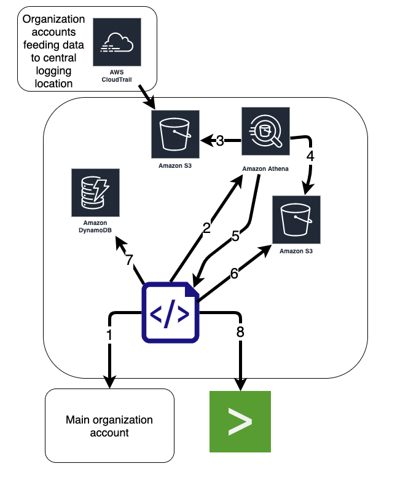
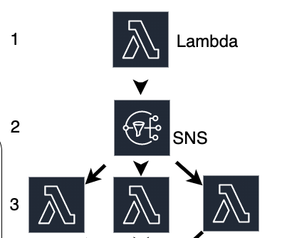

---

This is going to be an ongoing post for awhile. It was inspired by Netflix's skunkworks group who gave a [talk](https://www.youtube.com/watch?v=kWJoiZ9yMpg) at re:invent 2019 in regards to building a cloudtrail anomaly detection platform leveraging Amazon services. I highly recommend watching the talk.

I liked the idea, but not the deployment method netflix showcased. It didn't scale to the size I needed it to (Looking at the final product in production now it probably would have, but I didn't want to run and maintain an EC2 instnace). Additionally there were also some aspects that I reworked to lessen the load (and cost) of Athena queries. We'll talk more about these differences and more further in the post. This post will walk through [this](https://github.com/yogisec/cloudtrail-anomaly-serverless) code.

---

### Data Flow

Below is how the data and api calls are made within aws. The code in the middle is several Lambda scripts but for the data flow it made sense to consolodate them into a single entity.

An high level explaination for each of the steps in the diagram is below:

1. Query main orgaization account for a list of all accounts within the organization
2. Configure Athena tables, start query execution
3. Athena queries the CloudTrail S3 bucket(s) for all activity per account for the past hour
4. Athena sends results to S3 results bucket
5. Athena returns 'Success' message with along with the results object
6. Scripts grabs the results and parses them by unique role, event source, and event name
7. Each unique record is checked against DynamoDB table. If its new alert (if it meets criteria).
8. Send alerts to Splunk



---

### Inspiration
The original design is a script that runs off an Ec2 instance with the required role to access the CloudTrail events, Athena, S3, and DynamoDB. The original repo is [here](https://github.com/Netflix-Skunkworks/cloudtrail-anomaly) and I forked it [here](https://github.com/yogisec/cloudtrail-anomaly).

---

### Structural Differences

While porting the original concept over from what Netflix released. I decided that I didn't want to have to deal with the run and maintain of an EC2 instance. While its not a huge deal, it was just something that I didn't want to do. This is where we have our first major structural difference between the original source, and what was rolled into production. The deployment in my github repo is serverless. Kicked off by cron jobs running every hour.

Below is a expanded data flow showing the Lambda scripts, and what occurs at each stage.

1. Main Lambda function (Muster) kicks off based on CloudWatch cron configuration. It queries for account numbers in the organization, builds a date object, and for each account it sends the account, date object, and miscellaneous variables into an SNS message to trigger the discernment Lambdas.
2. SNS message triggers discernment Lambdas. One account per Lambda execution.
3. The discernment lambda checks for an Athena table for the account, if it doesn't exist it makes it, it also builds the table partition if it does not exist. Queries the CloudTrail logs in from an S3 bucket for ALL account activity for the past hour. The function gathers the results, parses them per ROLE, and checks the activity vs the DynamoDB table. If new behavior is detected, and it meets 'alert' criteria, an alert event is pushed to Splunk.



The next major difference is the Athena queries. The original code provides the ability to create a table if it does not exist. However, depending on how the data is structured within the S3 buckets, it may need to have paritions manually defined so that Athena can quickly search for the results it needs. Once the partitions have been defined, they must constantly be updated and maintained for each new day. Both of these were challenges that I had to address.

Another shift in the Athena queries is around the query to pull activity for the past hour. Initially I leveraged the original query:

```sql
SELECT DISTINCT eventsource, eventname FROM cloudtrail_123456789
WHERE useridentity.type = 'AssumedRole'
AND useridentity.sessioncontext.sessionissuer.principalid= 'PRINCIPAL_ID'
AND eventTime > to_iso8601(current_timestamp - interval '1' hour);
```

As the capabaility began to scale out I began to run into API rate limits between the Athena queries and S3. I also noticed that despite the fact that the query calls out a specific principal to search for the amount of data scanned by Athena was the same. I decided to shift the principal parsing to the Lambda function and changed the Athena query to pull back all of the account activity for the past hour. This introduced no noticiable overhead to the Lambda function but **DRAMATICALLY** reduced the number of Athena queries that were requred to produce the same results.


```sql
SELECT DISTINCT eventsource, eventname, useridentity.sessioncontext.sessionissuer.principalid, useridentity.type FROM "{business}_ct_anomaly_{account}"
WHERE year='{year}'
AND month='{month}'
AND day='{day}'
AND eventTime > to_iso8601(current_timestamp - interval '1' hour);
```

Another slight change in the query above was to pull back all useridentity types. This allows for some future growth. Instead of just looking at AssumedRole activity, the results now also contain all of the 5 useridentity types. In the future we plan to look at Root account activity, as well as local iam user account activity.

---

### Issues to Watch For

There are a few issues to watch out for. The biggest is to make sure that you are not hitting any rate limits with the Athena queries. AWS is pretty transparent about the rate limits for new query submitions, but the other key limit to look out for is the S3 rate limit. This can cause the queries to die.

Depening on the Dynamo deployment you may run into some limits when reading and writing. This is another key place to keep an eye out and adjust the deployment as needed.

The final place where issues may arise (I'm sure there are others) is with the Lambdas themself. Make sure the run time is long enough to comlete the work. Both Lambdas will run fairly quickly, but you'll want to make sure you tune them so that they are sized appropriatly.

---

### Tuning
Most of the tuning for incident severity is going to occur within the identity_types.py file. This file is structured with a class for each identity type to analyze. As of writing this the only identity type that is "complete" is the AssumedRole type. The script has the structure built for Root and IAMUser, but they have not been the main focus to get this moved from concept to production.

The basic flow of the Assume_Role class is to loop through each role within an AWS account. For each of the roles, loop through all of the cloudtrail events. If the action and the role match, query dynamodb to see if the pairing for the principal, event source, and event action exists within the database. If it does, update the TTL in dynamo. If it does not the script adds it to a list, and then enters into an "alert condition". The script has several differet stages to determine if it shoudl alert or not as well as what severity to apply to the alert based on various conditions.

What are the conditions to skip the alert? That is widly going to depend on your own environment. Here are some things that you may end up wanting to add, or adjust to fit your deployment.

- Entire roles to ignore
- Specific actions to ignore
- If the role is younger than X days (script is currently set to 15)
- If its an aws service
- If the number of new actions is less than X (script sets less than 5 to an information severity)

The above list covers what gets ignored, but what about severities? What should the SOC/IR teams spend time on? Once again this is going to entirely depend upon your own environments, the businesses risk tollerances, and other mitigating controls, etc. Within the identity_types.py file there are some sample ratings based on a few different scenarios....