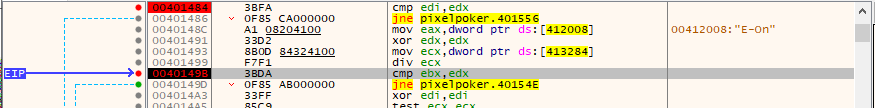

---

Walkthrough of the 2nd challenge in the Flare on 9 ctf.

---

### Overview
This challenge is called `Pixel Poker`. The description for the challenge is: 

```
I said you wouldn't win that last one. I lied. The last challenge was basically a captcha. Now the real work begins. Shall we play another game?
```

For this challenge there is a single binary "PixelPoker.exe" and a readme.txt with the following text: 

```
Welcome to PixelPoker ^_^, the pixel game that's sweeping the nation! 
Your goal is simple: find the correct pixel and click it
Good Luck!`
```

When the game loads the a screen like the one below appears:


As the description reads, the goal is to select the 1 winning pixel in the entire game board. After 10 failed attempts the game displays a "womp womp" message in a message box and resets.

---
### Analysis

After getting a feel for the program I began my analysis. Since the game displays a message box when the game has been lost, I started digging for the message. I figured somewhere before this was probably the logic that first had to determine if you had won or lost. The only way the program can determine if you won or lost is to compare what was clicked vs the winning combination. 

To find the message box I pulled up the symbol table in Ghidra and searched for the [MessageBoxA](https://learn.microsoft.com/en-us/windows/win32/api/winuser/nf-winuser-messageboxa) function.


Then I selected the syscall to see where within the application the call to MessageBoxA originates. By looking at the references I was able to determine the function `FUN_004012c0` calls messageBoxA. 


Selecting `FUN_004012c0` and moving to the decompiled code screen I was able to locate the `womp womp` message (pictured below, 5 lines down). Looking at the windows api definition for MessageBoxA we can determine that `Womp womp... :(` is the text displayed in the box itself and `Please play again!` is the text in the title bar.

Directly above the MessageBoxA call is the start of an "if" statement. Since I had played the game through this stuck out as the check to see how many turns had occurred. If 10 turns had happened show the womp womp screen. I renamed `DAT_00413298` to something more friendly: `Number_of_Attempts`. This renames the value everywhere even in the else block further down.


If the number of turns is not 10 we enter into the else block. The first line in the else is an incrementor which further confirms that `DAT_00413298` is the variable tracking how many attempts have been made. Continuing to move through the code the next statement is another comparison. This time two variables are checked. This seemed like this might be the block where the x and y values for the clicked pixel are compared. I continued to work through this block of code renaming things as I could.


The `clicked_x` and `clicked_y` variables were further confirmed when I got to the bottom of the decompiled code pictured above. The (now renamed) `Update_TitleBar?` function is what gets called to update the application title bar with the latest clicked guess. The variables passed into the function match the same variables compared above for what I am assuming is the bit of logic where the game determines if the correct pixel has in fact been selected.

Looking through the disassembly (pictured below) there is a CMP statement at `00401484`. Ghidra has already renamed the variable from the decompiler so it stands out as a line of interest. This line compares the value stored in EDX to the value of `clicked_x`. If they match the zero flag (ZF) is set to 1. The next line contains a `JNZ LAB_00401556` instruction. The JNZ operator means jump will be taken if the zero flag is not set, aka if ZF=0 take the jump. 


The same pattern exists a few lines down in the disassembly at `0040149b` but this time the comparison is happening between the `clicked_y` value and EDX. After the comparison if the zero flag is 0 a jump is taken to `LAB_00401d5`. 

Next, I moved over into a debugger to confirm the behavior. I started by setting 2 breakpoints. The first at `00401484` and a second at `0040149b`. I clicked a pixel in the game area and hit the first breakpoint. 


> The first time I went through this I NOP'd the jump instructions, but unfortunately got a bit crazy and kept NOPing EVERYTHING after. My hope was to catch the flag in memory, but I just ended up crashing the program. After sharing my current findings with a friend, they suggested not NOPing but just manipulating values. We'll circle back to the NOP approach later. 

Looking in the registry at the first breakpoint the values of EDX and EDI are different.


Using the debugger, I changed the values so they were equal. When I resumed the program, the jump was not taken and the application hit the second breakpoint at `0040149b`



Once again in the registry the values of EDX, and EBX are different, but were changed using the debugger.


Since the values matched, the zf was 0 and the jump was not taken. I let the application run and it went through a few loops (I'm assuming to deobfuscate the image). Finally, the image below was returned containing the flag.


---

## Bonus NOPs

Earlier in the article I mentioned that my first approach was to replace instructions with NOPs to simply skip over them. It would have worked, had I not been focused on trying to capture the flag in memory, but instead focused on getting the application to generate a "win" scenario. Now that I had seen the application run through to completion, I ran it again with the same breakpoints set.

This time I replaced the two jump instructions with NOPs. Below is a screen shot of how the debugger looked after replacing both jmps with nops.


As expected, after replacing those two instructions and letting the application run the flag is presented. The issue I ran into the first time attempting to replace the jmps with nops is I continued to replace all jmp instructions with nops. I believe I ended up replacing jmp instructions which are used to deobfuscate the image and resulted in the application crashing. Lesson learned for next time, don't get overly ambitious with NOPs.

---

## Official Write Up

The official write up solves this challenge in a completely different way and is worth a read too. The link to the write up is here: https://www.mandiant.com/sites/default/files/2022-11/02-pixelpoker.pdf.

For writes ups to all of the solutions or overall stats on this years flareon challenge mandiant made this post: https://www.mandiant.com/resources/blog/flareon9-challenge-solutions