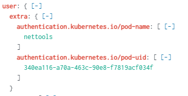

---

An overview of the Kubernetes api logs. What fields are useful, and some places where log visibility might be missing in most environments. 

---
### K8s Api Audit logs

There are several log sources in a Kubernetes environment. One of the best sources to use during an incident to determine what has occurred on a cluster are the api audit logs. These logs contain *all* of the requests made to query or modify objects in the cluster. On the surface the api audit logs can be a bit overwhelming. Much like any log source, the more you look at it and the more you work with it the easier it becomes to quickly digest the event data. As a responder there are a few fields we will want to pay attention to: requestURI, sourceIPs, verb, user.username, userAgent.

|field|purpose|
|---|---|
|requestURI|This is the resource requested answering the 'what' was requested|
|sourceip|Where the request came from|
|verb|Answers the question was this creating/modifying a resource or querying information about a resource|
|user.username|'who' made the request|
|userAgent|This is the user agent of the application that made the request |
|responseStatus.code| |
|annotations.authorization.k8s.io/decision|rbac decision, allow/forbid|
|annotations.authorization.k8s.io/reason|Description on why a request was allowed|
|user.extra.authentication.kubernetes.io/pod-name|pod where request originated|
|user.extra.authentication.kubernetes.io/pod-uid|pod uid where request originated|

Below is a sample api audit log event. 

```json
{
   annotations: {
     authorization.k8s.io/decision: allow
     authorization.k8s.io/reason: RBAC: allowed by ClusterRoleBinding "cluster-system-anonymous" of ClusterRole "cluster-admin" to User "system:anonymous"
   }
   apiVersion: audit.k8s.io/v1
   auditID: 5dbc599e-0726-45ae-a2e7-b1fb06c6e6f9
   kind: Event
   level: Metadata
   objectRef: {
     apiVersion: v1
     resource: secrets
   }
   requestReceivedTimestamp: 2022-06-17T12:01:14.222991Z
   requestURI: /api/v1/secrets
   responseStatus: {
     code: 200
     metadata: {
     }
   }
   sourceIPs: [
     172.20.39.107
   ]
   stage: ResponseComplete
   stageTimestamp: 2022-06-17T12:01:14.246392Z
   user: {
     groups: [
       system:unauthenticated
     ]
     username: system:anonymous
   }
   userAgent: curl/7.68.0
   verb: list
}
```

Digging into the event a bit we know the verb is `list` which tells us that this request is attempting to query data from the server. The username is `system:anonymous` which means no authentication was performed. The requestURI is `api/v1/secrets`, this api endpoint is used when attempting to retrieve all of the secrets from every namespace. If the requestURI was `api/v1/namespaces/test/secrets` then it would have been an attempt to just query secrets from the test namespace. 

The responseStatus.code value is a `200`, just like any other web response code a 200 means success. The two fields under annotations `authorization.k8s.io/decision`, `authorization.k8s.io/reason` tell us that the request was authorized from a RBAC pov. The reason goes into further detail of why it was allowed informing us that the ClusterRole `cluster-admin` is associated with the `system:anonymous` user via the ClusterRoleBinding `cluster-system-anonymous`

We can see the sourceIP is `172.20.39.107` which happens to be our load balancer in this scenario. If the request was internal to the cluster, it would have had an internal ip of the node the request originated from. This is important to note because in the event of malicious activity originating within a cluster which is also using the `anonymous` account, sourcing the k8s api requests back to the node is typically as close as you can get to answering "where" a request came from using the api audit logs. However, if a service account is being used the event will show the exact pod the request originated from as long as are current version of Kubernetes is being utilized. Older versions may not show this level of detail in the log output.

The userAgent value is `curl/7.68.0`. This field can easily be spoofed which makes it hard to trust that curl was used. However, it can often be used to link events together to understand activity originating from the same actor. 

By using this information, we can infer the request more than likely originated from outside the cluster and the command used to make the request was something similar to this: 

```bash
curl -k https://<KUBERNETES-API-LOAD-BALANCER-SERVER>/api/v1/secrets
```

Let's take a look at one more log output:

```json
{
   annotations: {
     authorization.k8s.io/decision: forbid
     authorization.k8s.io/reason:
   }
   apiVersion: audit.k8s.io/v1
   auditID: 4190c06f-5bb4-4654-a610-02af06ac0593
   kind: Event
   level: RequestResponse
   objectRef: {
     apiVersion: v1
     namespace: dev
     resource: pods
   }
   requestReceivedTimestamp: 2022-06-18T18:50:08.978700Z
   requestURI: /api/v1/namespaces/dev/pods?limit=500
   responseObject: {
     apiVersion: v1
     code: 403
     details: {
       kind: pods
     }
     kind: Status
     message: pods is forbidden: User "system:serviceaccount:dev:default" cannot list resource "pods" in API group "" in the namespace "dev"
     metadata: {
     }
     reason: Forbidden
     status: Failure
   }
   responseStatus: {
     code: 403
     metadata: {
     }
     reason: Forbidden
     status: Failure
   }
   sourceIPs: [
     172.20.59.66
   ]
   stage: ResponseComplete
   stageTimestamp: 2022-06-18T18:50:08.979502Z
   user: {
     extra: {
       authentication.kubernetes.io/pod-name: [
         nettools
       ]
       authentication.kubernetes.io/pod-uid: [
         340ea116-a70a-463c-90e8-f7819acf034f
       ]
     }
     groups: [
       system:serviceaccounts
       system:serviceaccounts:dev
       system:authenticated
     ]
     uid: eb04ad0d-29d6-4ea0-8df5-d666b26eebf9
     username: system:serviceaccount:dev:default
   }
   userAgent: kubectl/v1.24.2 (linux/amd64) kubernetes/f66044f
   verb: list
}
```

As we look through the event details, we can see that `kubectl` was used to query a list of pods within the dev namespace `requestURI=/api/v1/namespaces/dev/pods?limit=500`. The response was 403 because the service account (found in the user.username field) `system:serviceaccount:dev:default` does not have permissions to query for a list of pods within the `dev` namespace. There are some new fields in this event which help us to quickly identify which pod this took place in. Under the user section we see the following snip:



The information in the extras section tells us the exact pod that was used. Since we know the pod name as well as the pod-uid it provides us the opportunity to check the Kubernetes server to determine if the pod is still running. If it is, could snapshot the underlying containers in the pod for further analysis.

Based on the information in the audit log it would appear the command used to create the event was similar to:

```bash
./kubectl get pods -n dev
```

And if we are lucky enough to have a 3rd part tool such as Falco or some other tool providing runtime detection capabilities we might have an alert such as this one to help confirm and validate our assumptions:

```
   output_fields: {
     container.id: eddba1ff1c56
     container.image.repository: docker.io/raesene/alpine-nettools
     container.image.tag: latest
     evt.time: 1655578208694767400
     fd.name: 100.96.1.23:37794->100.64.0.1:443
     k8s.ns.name: dev
     k8s.pod.name: nettools
     proc.cmdline: kubectl get pods -n dev
   }
   priority: Notice
   rule: Contact K8S API Server From Container
```

---
### Kubelet logs

The kubelet is the control point for all the comings and goings on the node. Each node in the cluster will have a unique set of kubelet logs. Kubelet logs may be helpful when attempting to confirm when a particular container was started or removed. Depending on how it is configured the logs may have a lot of additional information available as well.

[This](https://docs.openshift.com/container-platform/4.6/rest_api/editing-kubelet-log-level-verbosity.html) page from RedHat has a handy reference chart for the different log levels available for the kubelet 

|Log verbosity|Description|
|---|---|
|--v=0|Always visible to an Operator.|
|--v=1|A reasonable default log level if you do not want verbosity.|
|--v=2|Useful steady state information about the service and important log messages that might correlate to significant changes in the system. This is the recommended default log level.|
|--v=3|Extended information about changes.|
|--v=4|Debug level verbosity.|
|--v=6|Display requested resources.|
|--v=7|Display HTTP request headers.|
|--v=8|Display HTTP request contents.|

At the time of writing kops deploys the kubelet with a default log level of 2 `/usr/local/bin/kubelet ... --v=2` unless otherwise specified. Below are some sample events that show a container being removed, the `nettools` pod being removed, and then a few seconds later the `nettools` pod being created.

```
Jun 18 19:42:16 ip-172-20-59-66 kubelet[5656]: {"ts":1655581336241.7104,"caller":"topologymanager/scope.go:110","msg":"RemoveContainer","v":0,"containerID":"9beafc9454c36cf07dec1793128629f2a80bb43ac65aac400458f44d398032a8"}

Jun 18 19:42:16 ip-172-20-59-66 kubelet[5656]: {"ts":1655581336244.2942,"caller":"kubelet/kubelet.go:2102","msg":"SyncLoop REMOVE","v":2,"source":"api","pods":[{"name":"nettools","namespace":"dev"}]}

Jun 18 19:42:34 ip-172-20-59-66 kubelet[5656]: {"ts":1655581354264.5642,"caller":"kubelet/kubelet.go:2092","msg":"SyncLoop ADD","v":2,"source":"api","pods":[{"name":"nettools","namespace":"dev"}]}
```

From a responder's point of view, these logs are more than likely not the most helpful but may be a good reference point. 

---
### host logs / security tools

Most hosts within a Kubernetes cluster are going to be Linux. This means that most if not all of the log sources traditionally used to analyze a Linux host can be used to help paint a picture of what has occurred on a compromised cluster. The same applies to 3rd party security tools. We briefly talked about Falco earlier, but other tools such has ossec, sysmon, osquery, and <$$ VENDOR> can all be used to gain more insights into the malicious activity. Please make sure to understand the limits of the tools though, especially when it comes to paid vendor solutions. A lot of the big players are much stronger in Windows and have gaps in visibility when it comes to *nix systems.

---
### Other places for logs
Depending on how the cluster is configured, and what support applications are being utilized there could be several additional places with valuable log information. Does the cluster use a service mesh, are there proxy containers deployed into every pod for the most part? If so, the proxy containers are great source of logs potentially. If it appears to be a pod or application compromise, do not forget to review the application logs and the logs for the application pod if it is still around.