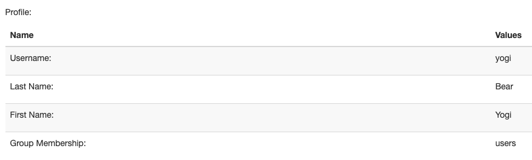
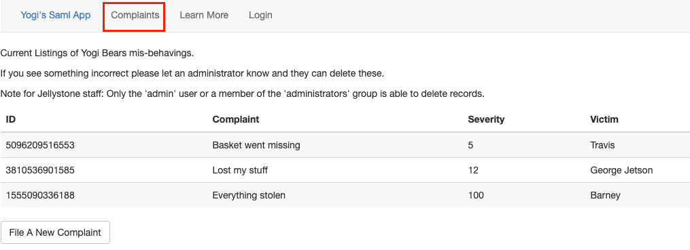
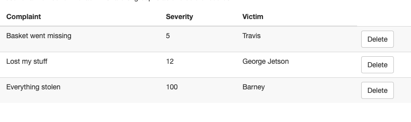
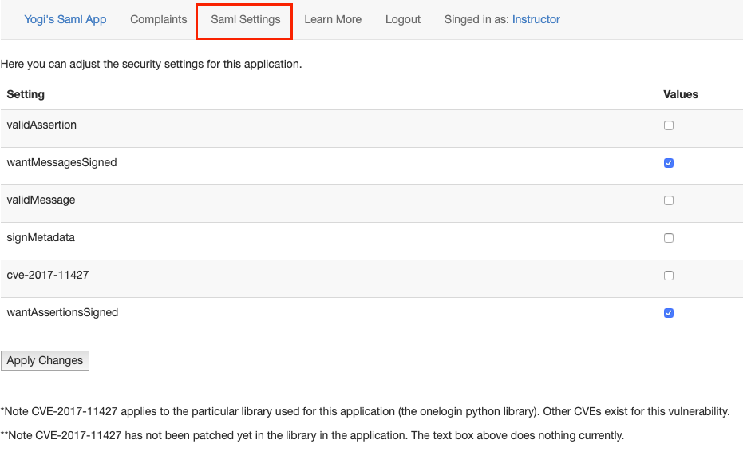

---

### What is this thing?
I built this app because I wanted to better understand SAML and I wanted to know how to discover, exploit, and remediate vulnearbilities associated with implementations. I created an easily deployable docker environment [here](https://github.com/yogisec/VulnerableSAMLApp) that can be spun up on a local machine in about 5 minutes. I also have instructions to split the deployment across multiple hosts.

This includes a fully functional IDP and a Service Provider. The Service Provider has several configuration options that allow for post deployment on the fly adjustments to the security stance of the application. When its fully deployed the environment will be similar to the architecture and data flows below:


Not sure what SAML is or looking for a refesher? Check out the [saml_overview](https://jellyparks.com/posts/saml-overview/) page.

---

### Back Story

For this scenario we are Yogi Bear. The Jellystone park staff have had enough of our stealing of picnic baskets. In an effort to track this behavior they have setup "Yogi's Saml App". This application allows park visitors to file complaints about our behavior.

Our goal as Yogi is to gain administrative access to the application via SAML implementation errors and delete the complaints. If we fail there is a possibility that we will be relocated to another park with no picnic baskets.

--- 

### Setting up the test environment

#### Quick and Easy Deployment

The easiest way to get everything up and running is by cloning the repository and then simply running a quick docker-compose command. The compose command will build the images, and deploy them to the local host.

```bash
git clone https://github.com/yogisec/VulnerableSAMLApp.git
cd VulnerableSAMLApp
sudo docker-compose up
```

The Service Provider will be listening on `http://127.0.0.1:8000`. The IDP will be listening at `http://127.0.0.1`. Head down to the [Features](https://jellyparks.com/web-things/vulnerable-saml-app#features) section for login details and more information about the applications.

#### Split Host Deployment

In order to split the deployment across two seperate hosts (one an IDP, and the other a SP). We need to change some configuration details.

First clone the repository onto both hosts:

```bash
git clone https://github.com/yogisec/VulnerableSAMLApp.git
cd VulnerableSAMLApp
```

On the host that will become the `IDP` run the `configure_platform.py` script. Work through the prompts filling in the information as requested to make the necessary edits to the IDP configuration files.

```bash
python3 configure_platform.py
```

If you had the script build the docker container for you run the container with the following command and then skip down to configure the SP:

```bash
sudo docker run -it --rm --name idp -d -p 80:80 idp:1.0
```

If you did not let the script build the container we need to build it. We can do that with the following command:

```bash
cd vulnerableidp
sudo docker build -t idp:1.0 .
```

This will build a container with the name `idp` and the tag `1.0`. Next run the container with:

```bash
sudo docker run -it --rm --name idp -d -p 80:80 idp:1.0
```

Confirm the container is running by running:

```bash
sudo docker ps
```

If its running we should see an output similar to:

```bash
189adee1b091 localhost/idp:1.0 apache2ctl -D FOR... 2 seconds ago Up 2 seconds ago 0.0.0.0:80->80/tcp idp
```

We can confirm the IDP is listening by running curl:

```bash
curl http://127.0.0.1
```

Next on the `Service Provider` host run the `configure_platform.py` script. Work through the prompts filling in the information as requested to make the necessary edits to the application configuration files.

```bash
python3 configure_platform.py
```

If you had the script build the docker container for you run the container with the following command and then skip down to the Features section to learn about the application:

```bash
sudo docker run -it --rm --name sp -d -p 80:80 sp:1.0
```

If you did not let the script build the container we need to build it. We can do that with the following command:

```bash
cd vulnerablesp
sudo docker build -t sp:1.0 .
```

This will build a container with the name sp and the tag 1.0. The next step is to run the container. This can be done with:

```bash
sudo docker run -it --rm --name sp -d -p 8000:8000 sp:1.0
```

We can confirm the container is running by issuing:

```bash
sudo docker ps
```

This should produce an ouput similar to this:

```bash
94476aee1abf sp:1.1 "uwsgi --ini vulnsp.…" 4 minutes ago Up 4 minutes 0.0.0.0:8000->8000/tcp sp
```

We can confirm the application is up and listening by curling the interface with:

```bash
curl http://127.0.0.1:8000
```

At this point the IDP and the SP should be up and running and accessible. The next section will provide an overview of some of the features of the application.

---

### Features of the environment

Login credentials:

|Username|	Password|	Description|
|---|---|---|
|yogi|	bear|	Basic user account, memeber of the 'users' group. No special permissions|
|admin|	this-is-the-administrator-pasword-oh-no-is-that-a-typo-in-password|	Regular administrator account, member of the admin group. This account has the ability to delete the complaints.|
|brubble|	password|	This is account was registered specifically for CVE-2017-11427|
|instructor|	G0od-LuckGu3ssingThisButHeyItCouldHappenRight?|	This account is allowed to reset the complain board back to its original state. Additionally this account was the ability to increase or decrease the security posture of the application.|


After successfully logging in we are presented with our profile as seen by the application. This is a quick and easy way to confirm which user we are, as well as our current group membership.



The complaints tab is where all of the complaints are stored and is the overall goal of the application.



In the screenshot below we have authenticated with the admin user account and have a new capability to delete complaints.



The `instructor` account has several special features to help maintain order within the application. There is a 'Restore Complaints' button on the complaints page that reverts all of the complaints back to the starting state of the application.


The instructor account also has a new tab called `Saml Settings`. Within this tab we can make the application more or less security by checking the features we want to have turned on or off.



---

### The Scenarios

|Setting|	Description|
|---|---|
|Nothing Configured|	The application accepts any SAML message, edit away, the application trusts everything.|
|Valid Assertion / Valid Messages|	The Service Provider is checking for valid assertions, any tampering results in the message being rejected. Unless we remove the signature block.|
|Want Assertions / Messages Signed|	The Service Provider requires the messages to be signed, but it doesn't check to see if they are valid signatures.|
|Everything Signed, Everything Valid|	This is the ideal deployment, messages must be signed and they must be valid, no tampering allowed.|
|CVE-2017-11427|	This is an implementation of CVE-2017-11427 which leverages comments within the SAML response XML to bypass security controls.|

Note: for all of the SAML message tampering below I am leveraging the SAML Raider plugin for burp. It handles the decoding of the messages on the fly and allows for edits. It also supports XSW attacks which are currently beyond the scope of this application.

Additional Note: When changing from one scenario to the next it is best to make sure you signed out before adjusting the security levels of the Service Provider (SP). This helps to ensure there are no unforseen outcomes.

---

#### Nothing Configured
For this scenario we'll use the security configuration pictured below.


Before we get to far into this scenario, I wanted to take a moment and say that this scenario, this configuration issue, is the MOST common implementation flaw that I come across.

Once we authenticate to our IDP we can make any changes to the SAML response that we want. The message will not be checked, the SP will simply process it as valid. The screenshot below shows the original assertion before tamper:

nothing_orig_assertion

Now, if we change our user group to the administrators group as pictured below we will successfully escalate our privileges from a regular user account to a full admin within the SP.

nothing_tamper_assertion

Once we pass the SAML response payload along to the SP we are now an administrator within the SP and as we can see below when we click on the complaints tab we now have the ability to delete all of the complaints.

nothing_delete

We can even take it a step further if we'd like and replace all of the fields within the response with fake information similar to the picture below. As the SP logs our 'malicious' doings it will log all of our fake information. The only true way to determine who we were before changing our use settings would be to sync up the logs from the IDP and the SP to determine who authenticated to the IDP before the malicious activity began.

nothing_fake

Above I mentioned that this configuration is the most common issue that I find when testing SAML implementations. The reason for this is because when most applications are initially configured to leverage saml the check box to make sure messages are secure is left unchecked. This allows the owners to validate that all of the backend configuration that occurs between the SP and the IDP is correctly configured without dealing with certificates. The unfortunate part is most of the time this is where things get left. The messages are left fully vulnerable to anyone who can authenticate to the IDP.

#### Valid Assertion / Valid Message / Both

For this scenario we'll use the security configuration pictured below. This scenario plays out the exact same way if validMessage is also checked, or if it is checked and validAssertion is not.

valid_assertion_config

On the surface this seems like the ideal configuration. The Service Provider is checking for valid assertions, any tampering with the assertion attributes results in the message being rejected. In the picture below we have authenticated as the Yogi user account, and our assertion payload includes attributes about our account including our group membership 'users'.

valid_assertion_group

We can attempt change the group membership to another group such as the 'administrators' group in the photo below.

valid_assertion_group_edited

Unfortunatly as we can see below the message is rejected because its not valid when compared to the signature for the message.

valid_assertion

There is a big security flaw with this configuration. The SP is only checking that the assertion is valid IF its signed. The application does not have signed messages as a requirement. If we remove the entire signature block from our SAML payload the message can be changed.

In the Burp intercept for the web traffic within the SAML raider tab we can click the 'Remove Signatures' button to remove the entire signature area of the XML SAML Response.

signed_signature_removed

When we attempt to tamper with the SAML response without a signature the SP accepts our resposne and we are now authenticated to the application as a member of the administrators group!

signed_success

#### Want Assertions / Messages Signed
Things are slightly improving with this deployment. With this configuration the Assertion and/or Message must be signed. Since the application requires a signature we cannot just remove the signature block like we did in the previous scenario. To prove all of this out we will use the configuration below:

signed_config

The first thing we can try is to simply remove the signature elements. We wont tamper with anything, just a quick test to see if we can remove the signatures and have the SAML response still be accepted by the SP.

signed_signature_removed

As expected with our current configuration settings the SP rejects the response payload because it is invalid.

signed_error

Perhaps we can leave the signature elements in the response message but change the assertion attributes? Below we can see the memberOf attribute value has been changed from the users group to the administrators group.

signed_group_change

Sending the response payload along and we are greated with a successful login as well as our new permissions as a member of the administrators group!

signed_success

Why did that work? The application is checking for signatures isn't it? Well it is and it isn't. The application in its current configuration is checking to make sure there are signature attributes within the SAML response and that it is signed with the trusted certificate. It's not actually checking if they are valid or not. If the signature elements are in the message the application assumes its legitimate and trust worthy.

#### Signed and Valid
In this scenario we'll use the following configuration:

signed_valid_config

This configuration is what is expected when deploying an application leveraging SAMl authentication. In this setup the SP requires that the messages are signed and that the signatures match the data in the overall message and the assertion. This means as an attacker we cannot tamper with the areas of the message which are used to calculate the signatures. This includes the attribute values within the assertion. Let's try out a couple things and see the outcomes.

There is a known bug with this deployment where when the application requires signed messages it will error on an attempt to sign out after a valid log in. The current work around is to either delete the session cookies, or to lower the security settings of the application by removing the requirement for signed messages to complete the log out. In the case of this application leaving the application with a requirement for the Assertions to be signed produces the same effect as also requirin the messages to be signed.

Lets try to remove the signature of the SAML response:

signed_signature_removed

This results in the error below, because the application is checking to see if the message is signed.

signed_valid_errors

Lets leave the signature but change the attribute values within the assertion.

signed_group_change

This results in another error. This is because the application is configured to make sure the messages are valid if they are signed.

signed_valid_errors

The next scenario is able to bypass this situation and it does so in a very intersting way.

#### CVE-2017-11427

In February of 2018 DUO labs release details about vulnerabilities in 6 libraries that application leverage to use for SAML. This includes the library used as the source for this application. The original article is here.

At a high level, you can add a comment in the middle of the XML assertion to change the attributes/values of the SAML response. The really damaging part of this is that depending on the library being used the comment may be ignored during the signature calculation of the message. So to the SP the message is still valid. For this application we'll need to lower our security settings in order to become vulnerable to this attack. The configuration is below:

cve_config

For this scenario we'll pivot away from the 'Yogi' user account and use the Barney Rubble (brubble) user account. Imagine that Barney is an employee who has 'power user' permissions within the Service Provider. He doesn't have full admin rights so deleting comments isn't avaialble to him. One of the things that he is allowed to do is create groups! He created a group called 'administratorsbutnot' and added his user account to the group. Lets see how the scenario plays out.

First we'll log in and confirm the group membership is correct, and that as Barney we do not have the ability to delete comments.

Login success and correct group membership:

cve_group

On complaints page we do not have access to delete:

cve_complaints

Now we will sign out and back in again, this time changing the SAML response to comment out the 'butnot' portion of the group membership like this: `administrators<!--butnot-->`

cve_comment

Success! We've logged into the application and it looks like we are now a memeber of the administrators group.

cve_group_admins

Checking the complaints page we now have the ability to delete comments!

cve_delete

---

### Other attacks
There are several more types of vulnerabilities that could exist. Message replays, where an attacker sends a message after its TTL has expired.

XSW attacks which take chunks of the SAML response and duplicate it and place it in various places within the response. In these scenarios the SP checks to see if a valid signed assertion/message/etc. exists and then processes the message. What if there are two assertions, the first valid, and signed but the second is not. Which will the application process? The first, second, last, cause it to crash?

The Yogi Vulnerable SP is not yet vulnerable to these attacks, but they're on the list.

---

### References

Great References:

- [RFC7522](https://tools.ietf.org/html/rfc7522)
- [SAML](https://developer.okta.com/docs/concepts/saml/)
- [Overview of SAML](https://developers.onelogin.com/saml)
- [Authentication vs Authorization](https://auth0.com/docs/authorization/concepts/authz-and-authn)
- [Bypassing SAML 2.0 SSO with XML Signature Attracks](https://research.aurainfosec.io/bypassing-saml20-SSO/)
- [Duo Finds SAML Vulnerabilities Affecting Multiple Implementations](https://duo.com/blog/duo-finds-saml-vulnerabilities-affecting-multiple-implementations)